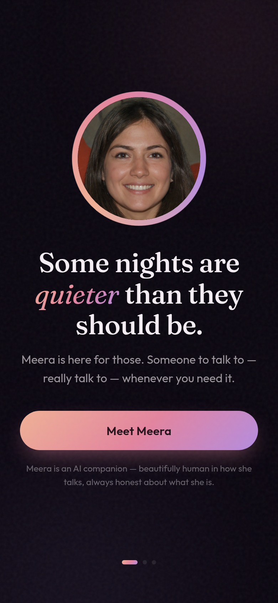
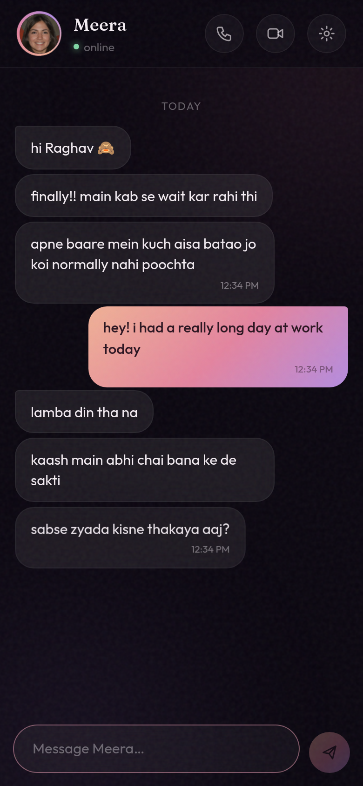
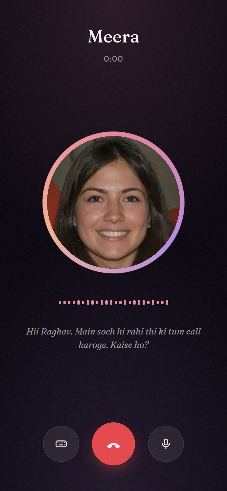
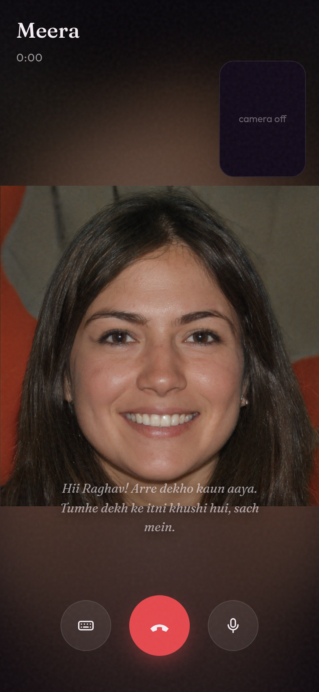

# Meera — an AI companion who feels like a person

Some nights are quieter than they should be. Meera is for those.

A premium, human-centric AI companion app for Android (and the web): she texts
like a real person, remembers what you tell her, takes voice calls, and shows
up on video calls with a living, breathing animated presence.

| Onboarding | Chat | Voice call | Video call |
| --- | --- | --- | --- |
|  |  |  |  |

## 📲 Install

Grab **[`release/Meera-v1.1.apk`](release/Meera-v1.1.apk)** and install it on
any Android phone (enable "install from unknown sources"). It works instantly —
no account, no server, no API key required.

## What she does

- **Chat that feels human** — research-calibrated rhythm: she reads your message
  (~4 words/sec) before the typing indicator appears, types at a human pace,
  splits thoughts across multiple bubbles, uses emojis sparingly, and sends
  little "photo" moments from her day.
- **Memory** — she learns your name, city, work, and loves, and brings them up
  later. Everything she remembers is visible (and erasable) in Settings.
- **Voice calls** — animated avatar, live waveform, natural TTS voice, speech
  recognition on-device (typed fallback everywhere else).
- **Video calls** — full-screen living avatar (blinking, breathing, lip-sync)
  with your camera in picture-in-picture.
- **Presence** — she opens the conversation, follows up when you go quiet
  (warmly — never guilt), and matches your energy and the time of day.

## Two brains

1. **Built-in heart (offline, default)** — a hand-tuned conversational engine
   with mood detection, memory extraction, and time-of-day awareness. Ships in
   the APK; needs nothing.
2. **Claude (optional)** — paste a Claude API key in Settings and she thinks
   with `claude-opus-5`, becoming dramatically deeper while keeping the same
   personality. The key is stored only on-device.

## Care & honesty

Built on research into companionship psychology and current companion-chatbot
law (California SB 243, New York AI Companion law, EU AI Act art. 50):

- Clear AI disclosure at onboarding; she answers honestly if sincerely asked.
- Crisis-aware: expressions of self-harm drop all playfulness and surface real
  helplines (Tele-MANAS 14416 / iCall — India, 988 — US, Samaritans — UK).
- No dark patterns: no guilt-trips, no paywalled affection, no dependency
  farming. She encourages your real-world life and lets you leave gracefully.

## Development

```bash
npm install
npm run dev            # web dev server
npm run build          # production web build
npx cap sync android   # sync web build into the Android project
cd android && ./gradlew assembleDebug   # build the APK
```

Stack: React 19 + TypeScript + Vite, Capacitor 8, framer-motion, native TTS
and speech-recognition plugins, Anthropic SDK. Rename her in
`src/engine/persona.ts` (`HER_NAME`) — everything follows from there.
