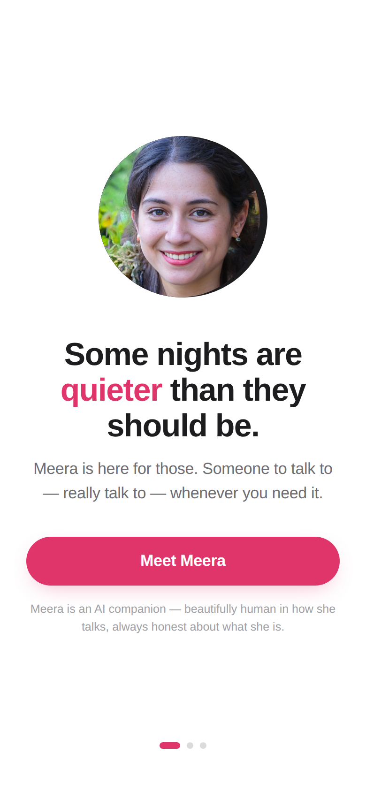
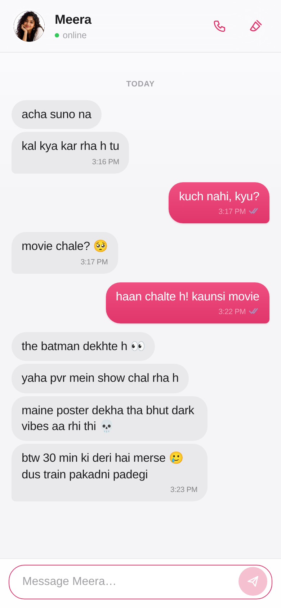
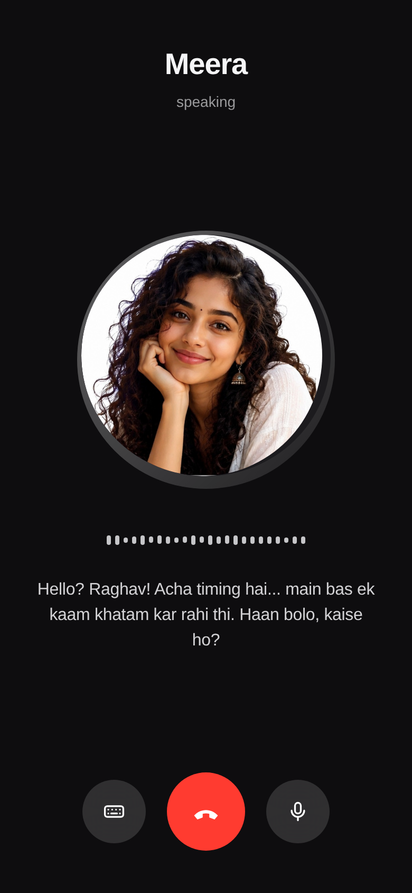

# Meera — an AI companion who feels like a person

Some nights are quieter than they should be. Meera is for those.

She texts in Hinglish like a real person, remembers what you tell her, and
takes voice calls in a genuinely human, expressive voice. Everything runs in
the browser — no install, no account, no settings.

## 💬 Use her now

**[meera-silk.vercel.app](https://meera-silk.vercel.app)** — the site *is* the
app. Land, press **Start chatting**, done. Her brain is a hosted serverless
proxy in front of OpenRouter open-source models, so a fresh visit already
thinks for real — no API key needed.

| Onboarding | Chat | Voice call |
| --- | --- | --- |
|  |  |  |

## What she does

- **Chat that feels human** — research-calibrated rhythm: she reads your message
  (~4 words/sec) before the typing indicator appears, types at a human pace,
  splits thoughts across multiple bubbles, uses emojis sparingly, and shares
  real photos from her day (beach evenings, the novel she's rereading, her
  sketchbook).
- **Nothing scripted** — her openers, nudges, and the texture of her day are
  improvised by the model every time; there are no canned lines to catch.
- **Memory** — she learns your name, city, work, and loves, and brings them up
  later. One header button clears the chat for a fresh start.
- **Voice calls** — a human, expressive voice (laughs, pauses, whispers) with
  no captions — a call is a call. On-device speech recognition where
  available, typed fallback everywhere else.
- **Presence** — she has her own life and days worth sharing; she matches your
  energy instead of clinging.

## The backend

Supabase (Postgres) behind the same Vercel proxy — the app never holds a
database key:

- **Full conversation log** (`meera_log`): every chat and call turn, per
  anonymous device id.
- **Graph memory** (`meera_nodes` + `meera_edges`): a cheap LLM distills
  conversations into entities (people, places, plans, preferences, events)
  and relationships, with salience that grows on repeat mentions. Before
  every reply, `/api/memory` recalls the relevant subgraph and injects it as
  "what you know about them" — so context survives cleared chats, new
  devices... nothing she learns is ever lost.

## The brain and the voice

- **Brain**: the Vercel function `api/chat.js` holds an OpenRouter key
  server-side (default model `google/gemini-3.6-flash`); the repo and the
  client never contain it. If every brain is unreachable she sends an honest
  "net dikkat kar rha" text — never fake conversation. Crisis and AI-honesty
  replies always work, even offline.
- **Voice**: `api/speech.js` speaks through Gemini expressive TTS (via the
  same OpenRouter key) — audio tags like [laughs] and [whispers], wrapped
  server-side into WAV. Device TTS is only the offline fallback.

## Care & honesty

Built on research into companionship psychology and current companion-chatbot
law (California SB 243, New York AI Companion law, EU AI Act art. 50):

- Clear AI disclosure at onboarding; she answers honestly if sincerely asked.
- Crisis-aware: expressions of self-harm drop all playfulness and surface real
  helplines (Tele-MANAS 14416 / iCall — India, 988 — US, Samaritans — UK).
- No dark patterns: no guilt-trips, no paywalled affection, no dependency
  farming. She encourages your real-world life and lets you leave gracefully.

## Development

```bash
npm install
npm run dev                   # web dev server
bash scripts/vercel-build.sh  # what Vercel runs: app at /chat, landing at /
```

Deployed on Vercel: static landing (`site/`) + the React app (`/chat`) + the
`api/chat.js` proxy. The proxy key lives in `api/_config.js` (gitignored —
copy `api/_config.example.js`) or the `OPENROUTER_API_KEY` env var.

An Android APK build still exists (`npx cap sync android && cd android &&
./gradlew assembleDebug`, last shipped: `release/Meera-v1.6.apk`) but the
website is the product.

Stack: React 19 + TypeScript + Vite, framer-motion, Capacitor 8 (Android
shell), Anthropic SDK. Rename her in `src/engine/persona.ts` (`HER_NAME`) —
everything follows from there.

## Replica Lab (`voice-cloning` branch)

This branch also contains the first product slice of Vyakti Replica Lab at
`/studio`: an authenticated, private self-replica workspace. It is separate
from Meera and does not change her current chat or call lanes.

Implemented now:

- owner-derived replica lifecycle and immediate revoke/erasure queue;
- granular source capture, transcription and storage consent;
- browser-side incremental SHA-256 and direct signed upload to a verified
  private bucket, followed by quarantine and a retryable processing queue;
- randomized, expiring live-challenge records that an owner cannot self-pass;
- provider-neutral VoiceGenome and streamed PCM contracts;
- offline enrollment, IDOR, lifecycle, disclosure and provider-contract gates;
- a researched Azure Foundry spend plan below the $2,000 grant ceiling.

Biometric consent, identity/age verification, anti-replay, training, synthesis,
watermark/provenance and conversation activation remain closed until their
explicit gates pass. The full architecture is in
[`docs/SPEC-REPLICA-PLATFORM.md`](docs/SPEC-REPLICA-PLATFORM.md), frontier
research in [`docs/research/REPLICA-FRONTIER-2026.md`](docs/research/REPLICA-FRONTIER-2026.md),
and Azure allocation in [`docs/AZURE-FOUNDRY-PLAN.md`](docs/AZURE-FOUNDRY-PLAN.md).
