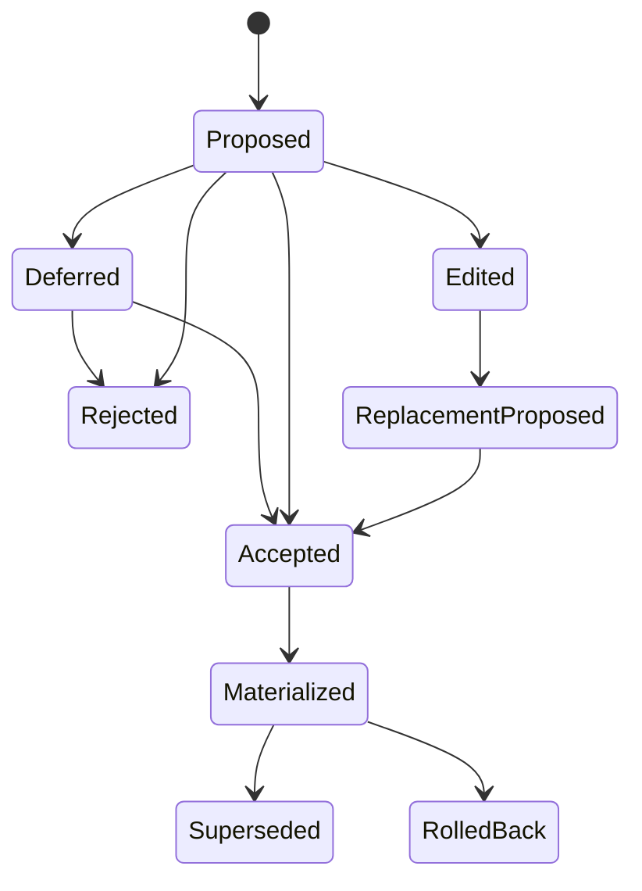

# Human Experience Compiler

**Status:** implementation specification, 2026-08-30  
**Research basis:** `research/MULTIMODAL-HUMAN-EXPERIENCE-COMPILER-2026-08-30.md`  
**Safety baseline:** `MIRROR-CALL-SPEC.md`, `SPEC-GURUKUL.md`, and the decisions in `context/`

## Purpose

The Human Experience Compiler is the shared path from owner-authorized source material to a better clone. It is not a new personality database and it is not continuous model training.

It normalizes recordings, uploaded audio and video, documents, text, images, authorized channel data, and calls into source-bound observations. Those observations may produce reviewable candidates for five independent layers:

1. knowledge;
2. persona and communication habits;
3. one relationship or dyad;
4. observable expression and interaction timing;
5. voice identity and owner-approved delivery styles.

Only an authenticated owner decision can promote a durable candidate. Session observations may guide the current call, but expire unless they become a reviewed candidate. No extractor writes a published persona, relationship state, or active voice directly.

## Current implementation truth

Vyakti already has most of the durable authority:

- `vy_replica_source`, processing artifacts, evidence, and evidence decisions for private source lineage;
- `vy_replica_claim`, exact claim citations, claim decisions, and extraction runs for reviewed knowledge and persona proposals;
- deterministic `vy_replica_profile` versions for the published Person Model;
- `vy_episode`, `vy_fact`, `vy_rel_event`, `vy_rel_state`, `vy_pattern`, `vy_phrase`, and the existing reducers for RelationalOS;
- `vy_mirror_window`, deltas, feedback, turns, and conditioning for Mirror Call;
- VoiceGenome and voice-profile versions for voice identity;
- source, replica, relational, and provider erasure paths.

The release candidate now connects the first bounded paths:

- successful Mirror Call ASR writes exact canonical transcript and language evidence in the same settlement as the window;
- call evidence enters the durable five-minute nearline queue only after the owner confirms that the exact ended session contains only their speech; a negative or uncertain choice is durable and cannot close another session's work;
- the nearline worker retries cited claim extraction outside call latency, uses a strict structured-output provider contract, and leaves every proposal under owner review;
- accepted event and relationship claims materialize as cited, participant-scoped RelationalOS episodes and facts, and the next Mirror reply retrieves only that exact owner, replica, agent and person scope;
- rejecting or superseding a claim retracts its relational projection, retires dependent Person Model versions, closes bound runtime capabilities and sessions, and the runtime rechecks the current claim set and training authority before every activation or private session;
- Context Locker owner documents and declared-owner chat turns write exact text spans; verified images write geometry and hash evidence only, with OCR and visual meaning explicitly not run;
- short-lived Mirror expression rows collect four transcript mechanics plus direct PCM RMS energy, never an emotion or personality label;
- Mirror Call keeps a content-free ended-session recovery receipt in same-tab storage so a reload or lost response returns to speaker review without retaining audio, transcript or inferred traits;
- source and replica erasure reach the new evidence, queue, expression and relationship derivatives.

The code and migrations are not the same as a production quality result. Migrations 068 through 070 are live and their final statements have passed read-only Neon `EXPLAIN`; the newest API and Studio changes still require the final release gate, deployment and an authenticated production call canary. The production nearline worker also remains disabled until a fresh provider credential, model, rates and application budget are configured. No production owner-speaker similarity caller currently admits Mirror Call windows into voice conditioning.

The deterministic envelope implementation is in `api/_experience-compiler/contracts.js`. It validates source, observation, candidate, decision, supersession, and materialization commitments. It deliberately does not create a second database. `api/_experience-compiler/README.md` maps each envelope to the existing authority.

## One source model

Every admitted source needs one rights and provenance envelope:

```text
owner + replica
source bytes or authorized handle + content hash
modality + exact address unit
participant and speaker scope
allowed purposes
captured time + valid time
retention + revocation state
producer/model/code commitments
```

The allowed purpose set is intersected down the derivation graph. Combining evidence can never grant a purpose that a parent source did not have.

Every unit of a source ends in an accountable state: accepted evidence, excluded third-party material, unusable with a named reason, or skipped by policy. A generic processed badge is not sufficient.

## Evidence atoms

An evidence atom is the smallest thing a candidate can cite. Its locator is modality-specific:

| Modality | Exact locator |
|---|---|
| audio or call audio | start and end milliseconds |
| video | start and end milliseconds plus optional frame region |
| document | page and character span |
| text, chat, or link | message or UTF-8 byte span |
| image | pixel region plus image commitment |

Each atom binds:

- source and parent hashes;
- owner, replica, participant, and optional dyad;
- direct observation or model inference;
- confidence and calibration lineage;
- producer name, revision, and code hash;
- language and speaker attribution where applicable;
- expiry when the observation is session-bound;
- the exact consent receipt and allowed purpose.

Evidence is immutable. A better compiler emits a new atom and supersession edge rather than overwriting the old interpretation.

## The five layers

### Knowledge

Knowledge candidates contain explicit claims, teachings, preferences, plans, corrections, and contradictions. They keep capture time, mentioned time, and validity time separate. They materialize through the existing reviewed claim and Person Model path.

### Persona

Persona candidates describe compact, context-specific behavior shapes such as explanation order, uncertainty language, register, code-switching, correction style, humor form, refusal, repair, sentence length, and pacing. They are never example sentences to recite and never a psychological diagnosis.

### Relationship

Relationship candidates name an authenticated agent-person dyad. They record observable events such as a request, promise, completion, correction, boundary, gratitude, apology, repair, open loop, or repeated ritual. Accepted candidates materialize as cited RelationalOS events. The existing reducer, not the extractor, updates relationship state.

Global owner behavior and one dyad's history remain separate. Retrieval filters owner, replica, agent, person, audience, purpose, and valid time before any semantic search.

### Observable expression

Expression is split into four tiers:

1. direct acoustics: rate, pauses, pitch range, energy, overlap, and non-speech events;
2. linguistic delivery: emphasis, hedging, elongation, repetition, and code-switch position;
3. interaction behavior: interruption, backchannel, response timing, and repair;
4. optional calibrated observer interpretations.

Tiers 1 to 3 are measurable cues. Tier 4 stays shadow-only until language, culture, speaker, and device calibration passes. None may assert inner emotion. In an education deployment, student emotion inference is disabled.

Expression observations are owner, dyad, session, and turn scoped and expire within 24 hours. The first release stores and displays them only. They do not change a reply or durable persona.

### Voice and delivery

Voice identity and expression are promoted independently:

- the identity anchor is verified clean owner speech selected for likeness and intelligibility;
- the style atlas is a reviewed set of owner-labeled contexts such as explaining, asking, correcting, encouraging, joking, reflecting, and firm refusal.

More duration is not learning. A candidate changes the voice only when a bounded owner-verified window or evaluated adapter is selected and the active consent is rechecked. Every response binds a content plan, delivery plan, model version, reference artifact, disclosure, watermark, and protection receipt.

## Candidate and review state machine



An edit creates a replacement candidate linked to the original hash. It never mutates the evidence the owner reviewed. Only `Accepted` may materialize. Rejection and deferral remain visible and idempotent.

## Source adapter policy

| Source | First eligible layers | Required guard |
|---|---|---|
| direct recording | voice, delivery, persona | verified owner speaker and bounded clean windows |
| uploaded owner audio/video | knowledge, persona, delivery, voice | diarization, owner attribution, third-party exclusion |
| documents, text, chats | knowledge, persona, relationship | author/message boundaries and exact citations |
| images/screenshots | visible facts and presentation patterns | OCR/region citation; no protected or inner-state inference |
| Mirror Call | current dyad, corrections, turn behavior, candidate voice windows | live scope recheck, session/window citation, owner review |
| YouTube | metadata and authorized captions first | official owner OAuth; original-file handoff for media analysis |
| Instagram | authorized professional media or owner export | official API/export; no consumer-account scraping |
| arbitrary URL | permitted public text/metadata | connector-specific terms; never an implied voice-training license |

## First production slice

The first falsifiable path is:

```text
Mirror WAV
  -> private verified source
  -> ASR
  -> canonical transcript and language evidence
  -> cited fact/persona/relationship proposal
  -> owner accepts or rejects
  -> new Person Model or cited relationship event
  -> reload
  -> dyad-safe retrieval
  -> protected reply
```

The model call is nearline and never part of turn latency. A session-end sweep may create proposals only when a real source, exact citations, required scopes, and speaker/participant policy pass. A missing runner is reported as not connected rather than queued.

The same release adds expiring expression observations in collect-only mode. They cannot influence the response until the expression calibration and blinded response-appropriateness gates pass.

## Negative controls

The release must prove all of the following:

- another owner's, another dyad's, or another replica's evidence cannot enter a candidate;
- an unverified speaker cannot enter owner voice conditioning;
- clone playback cannot re-enter the learning pool;
- revoked consent stops the next ASR, extraction, and voice admission action;
- an expired expression observation is not returned;
- rejected and deferred candidates do not alter a profile or relationship state;
- direct extractor output cannot write `vy_rel_state`;
- source deletion removes or tombstones source-derived payloads and citations;
- repeating a session-end or materialization request is idempotent;
- rollback restores the exact previous active version;
- no field can claim inner emotion or protected traits;
- no globally relevant result can bypass owner, agent, person, audience, purpose, and valid-time filters.

## Release sequence

1. Land the deterministic contracts and negative controls.
2. Emit canonical Mirror evidence and reuse claim extraction.
3. Add the expiring expression observation table in collect-only mode.
4. Expose the existing claim review surface in the main signed-in journey.
5. Add one accepted-claim to RelationalOS materializer and erasure reach checks.
6. Route Mirror replies through the same approved Person Model and relationship snapshot as the private dialogue runtime.
7. Add document/image adapters to the canonical evidence DAG.
8. Add lawful YouTube and Instagram connectors after deletion and rights tests pass.
9. Add an owner-labeled style atlas and promote voice artifacts only through blinded identity, intelligibility, naturalness, style, and safety gates.
10. Consider full-duplex and offline model fine-tuning only after the evidence-to-behavior cascade wins the complete benchmark.

## Current gap register

This is the honest distance from the current release candidate to the intended human clone. A green contract test does not close a product-quality gap.

| Gap | Current state | Required evidence before promotion |
|---|---|---|
| owner speaker attribution in calls and mixed media | ended calls require an exact-session owner choice before extraction; a negative choice is durable, but there is no calibrated automatic speaker scorer | speaker-disjoint calibrated scorer, third-party negatives, and measured false-admission rate while retaining owner review as fallback |
| automatic nearline proposal creation | a durable five-minute worker, leases, retries, spend reservation, erasure, strict Azure/OpenRouter provider arms and visible call-end status are implemented; production provider settings are intentionally incomplete pending credential rotation | fresh credential, bounded budget/rates, deployed fault-injection canary, one real provider result, owner review journey and stale-job alert readback |
| expression-aware delivery | four transcript mechanics and direct PCM RMS energy are collected for at most 24 hours and are not consumed | pause, pitch, overlap and event measurement; speaker-disjoint calibration; observer agreement; cultural and language slices; blinded response-appropriateness win; safe fallback |
| response-time relationship use | accepted event and relationship claims materialize to a participant-scoped dyad episode/fact and exact-scope retrieval is wired into Mirror replies; rejection now retracts relationship and profile/runtime projections | authenticated deployed accept, reload, reject and later-call retrieval trace, plus cross-dyad leak canary |
| documents and images | owner-authored text, declared-owner chat spans and image geometry/hash now share canonical evidence and erasure; OCR, page mapping and image semantics are not run | retained-source OCR with region citations, scanned-PDF controls, image claim precision audit and production canary |
| YouTube and Instagram | not a general media downloader; only official owner-authorized routes are acceptable | official OAuth/API or owner export, rights receipt, refresh and revocation deletion tests, plus original-file handoff for voice analysis |
| expressive voice identity | identity reference selection and protected synthesis exist; there is no reviewed context-style atlas | owner-labeled styles, exact-text blind listening, identity/intelligibility/naturalness/style cells, and rollback-safe artifact versions |
| full-duplex calls | session readiness and bounded turn audio exist; no complete production interruption and barge-in benchmark is closed | phone and network matrix for first audio, interruption, echo, recovery and 30-run tail latency per language/device cell |
| offline adaptation or fine-tuning | no connected training runner, and no hot-path weight update is claimed | consented owner-only dataset, immutable recipe, held-out identity/content/privacy gates, cost cap, rollback and no-regression result |
| human quality verdict | proxy identity and ASR metrics exist for several model experiments | accepted blinded owner/listener ratings; no model is promoted from ECAPA, WER or a vendor benchmark alone |
| broader-account release | production is still explicitly marked as an internal self-test environment and has tagged automatic grants; a dry run on 2026-08-30 found 171 active consent rows across 33 self-test-verified replicas | disable both server and Vite self-test settings, rotate exposed provider credentials, revoke only the tagged test grants with the idempotent script, then run a fresh real-consent phone journey and cross-account isolation canary |

The build order follows the dependency chain: attribution before extraction, extraction before owner review, review before durable relationship state, calibration before expression consumption, and matched human evaluation before voice promotion.

## What success means

There is no single human-clone percentage. A release reports independent results for source coverage, speaker attribution, ASR/OCR, citation precision, memory and temporal reasoning, cross-dyad privacy, persona consistency, expression calibration, response appropriateness, voice likeness, intelligibility, naturalness, interaction latency, protection, rollback, and erasure.

The system may call itself improved only when an accepted candidate creates a version, that version passes its named evaluation cells, activation succeeds, and rollback remains available.
