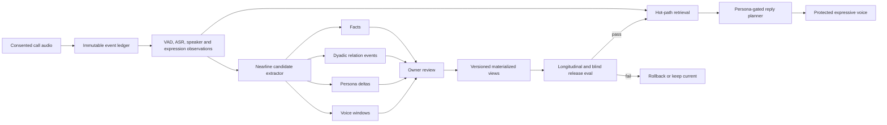

# Continuous human-clone frontier: calls, memory, expression, and voice

**Research date:** 2026-08-29

**Scope:** continuous learning from calls and uploaded context, relational memory, stable persona modeling, expression-aware interaction, controllable cloned voice, and truthful runtime status
**Evidence boundary:** this document is architecture research. It does not claim the production call path or any candidate model passed the proposed evaluations. Production state must come from a deployed canary and durable readback.

## Executive verdict

The product should not train itself on every call turn. The frontier supports a more reliable design:

1. Preserve what happened as a consented, immutable, source-bound event.
2. Use that event immediately for the current conversation.
3. Extract fact, relationship, persona, expression, and voice **candidates** nearline.
4. Let the owner accept, reject, defer, edit, or undo durable changes.
5. Materialize only accepted changes into versioned persona, relationship, fact, and voice views.
6. Evaluate the new version against the old version before promotion.

This is not a slower compromise. It separates two jobs with different latency and risk:

- **Hot-path adaptation:** retrieval, contextual response, turn-taking, expression-aware delivery, and selecting an already-approved voice condition.
- **Durable learning:** modifying what the clone believes, how it behaves, which relationships it carries, or which voice identity artifact it uses.

The first can happen within a call. The second must be traceable and reversible. Gradient updates do not belong in the call path.

The most important product-language correction is also scientific: an audio model can measure how observers may interpret vocal expression. It cannot prove what someone internally feels. Hume's own documentation makes this distinction explicit, and its use-case guidance warns that expression varies by context and culture ([Hume EVI FAQ](https://dev.hume.ai/docs/speech-to-speech-evi/faq), [Hume use-case guidelines](https://dev.hume.ai/docs/resources/use-case-guidelines)). Vyakti should store `expression_observation`, never `the user is angry` as a durable human trait.

## What the strongest systems actually do

### Long-term memory is a system, not a longer prompt

The converging architecture is layered memory:

- [CoALA](https://arxiv.org/abs/2309.02427) separates modular memory and structured internal/external actions.
- [Generative Agents](https://arxiv.org/abs/2304.03442) combines an experience stream, retrieval, reflection, and planning. Its ablations found observation, planning, and reflection each mattered to believability.
- [Letta](https://github.com/letta-ai/letta/blob/main/letta/schemas/memory.py) separates bounded, always-in-context memory blocks from larger recall and archival memory.
- [Graphiti](https://github.com/getzep/graphiti) uses incremental temporal graph updates, hybrid semantic/keyword/graph retrieval, and bitemporal event and ingestion time.
- [Mem0](https://arxiv.org/abs/2504.19413) dynamically extracts, consolidates, and retrieves salient information. Its authors report a lower p95 latency and token cost than full-context baselines on LoCoMo, but those are paper results, not Vyakti measurements.

The evaluation frontier has moved beyond “did the assistant remember one fact?”:

- [LoCoMo](https://arxiv.org/abs/2402.17753) tests long-term dialogue question answering, event summarization, and multimodal generation.
- [LongMemEval](https://arxiv.org/abs/2410.10813) isolates information extraction, multi-session reasoning, temporal reasoning, knowledge updates, and abstention.
- [LongMemEval-V2](https://arxiv.org/abs/2605.12493) adds static state recall, dynamic state tracking, workflow knowledge, environment gotchas, and premise awareness over histories as large as 500 trajectories and 115 million tokens. Its best reported method still reaches 72.5%, so “world-class memory” remains a measurable open problem rather than a solved component.

**Vyakti consequence:** keep raw episodes, source-cited facts, bitemporal validity, relation events, materialized relational state, and persona sheets as separate objects. A summary is a view, not the source of truth.

### Persona stability needs architecture and longitudinal tests

[PersonaGym](https://arxiv.org/abs/2407.18416) evaluates action justification, expected action, linguistic habits, persona consistency, and toxicity control over 200 personas and 10,000 questions. Its main warning is useful here: more capable base models did not automatically become much better persona agents.

The nearest published analogue to owner corrections is CIPHER in [Aligning LLM Agents by Learning Latent Preference from User Edits](https://arxiv.org/abs/2404.15269). It induces concise preferences from edits and retrieves context-relevant preferences later. The paper's rolling global-preference variants sometimes underperform no learning, while retrieved, context-keyed preferences perform better. This supports three Vyakti laws:

- Learn behavioral **shapes**, not transcript lines that can be recited.
- Keep deltas context-keyed instead of endlessly rewriting one global description.
- Let the owner inspect and change what was learned.

**Vyakti consequence:** a call can propose “warmer register with students” or “uses ‘basically’ as a short verbalism.” It may not silently overwrite the published persona or infer a permanent trait from one stressed call.

### Expression understanding is useful, but narrower than “emotion detection”

There are three deployable tiers:

1. **Acoustic observations:** pitch, energy, pace, pauses, laughter, breath, overlap, and turn timing. These are measurable and interpretable.
2. **Learned expression representations:** [emotion2vec](https://arxiv.org/abs/2312.15185) learns general speech-emotion representations, but a downstream task still needs labels and population-specific calibration.
3. **Named expression distributions:** [SenseVoice](https://github.com/FunAudioLLM/SenseVoice) combines ASR, language, speech-emotion, and audio-event outputs. Its current documentation claims 50+ language ASR, while the documented emotion-label training examples enumerate Chinese, English, Cantonese, Japanese, and Korean. That is not evidence of calibrated Hindi or Hinglish emotion recognition.

Hume's EVI 4-mini officially lists Hindi and produces sentence-level prosody measures; it describes those scores as likely observer interpretations, not the presence or intensity of inner emotion ([EVI overview](https://dev.hume.ai/docs/speech-to-speech-evi/overview), [EVI FAQ](https://dev.hume.ai/docs/speech-to-speech-evi/faq)). This makes Hume a useful sealed shadow-evaluation arm, not an automatic source of durable human facts.

OpenAI's Realtime API exposes server VAD, semantic VAD, transcription, and diarized transcription options. Its own event documentation says input transcription is asynchronous and may diverge from the audio model's interpretation, so transcript text must remain a derived artifact with confidence rather than the audio's canonical truth ([Realtime API](https://platform.openai.com/docs/api-reference/realtime), [Realtime transcription events](https://platform.openai.com/docs/api-reference/realtime-server-events/input_audio_buffer/committed)).

**Vyakti consequence:** expression observations should be turn-scoped, dyad-scoped, confidence-bearing, source-cited, and short-lived. Only an owner-approved behavioral preference can become durable persona material.

### Expressive voice and cloned identity are still separate axes

The current frontier exposes a recurring tradeoff: a model can preserve speaker identity, follow style instructions, speak Hindi accurately, stream quickly, or sustain natural full-duplex timing. No primary source demonstrates that one deployable model wins every axis for the same Hindi/Hinglish owner.

| Candidate | Primary-source capability | Constraint that matters for Vyakti | Ship verdict now |
|---|---|---|---|
| **Chatterbox Multilingual V3** | MIT, 23+ languages, Hindi and a dedicated Hindi pack, 500M parameters, reference-conditioned cloning ([model card](https://huggingface.co/ResembleAI/chatterbox)) | The source takes one reference and truncates its speech conditioning; language/reference mismatch can affect accent ([source](https://github.com/resemble-ai/chatterbox/blob/master/src/chatterbox/mtl_tts.py)) | Keep as the protected incumbent. Promotion still requires owner-blind Hindi/Hinglish listening, intelligibility, and identity gates. |
| **Fish Audio S2** | 50+ languages, multi-turn/multi-speaker generation, 10 to 30 second cloning, word-level free-form control, reported RTF 0.195 and under-100 ms TTFA on a single H200 ([technical report](https://arxiv.org/abs/2603.08823), [release](https://github.com/fishaudio/fish-speech/releases)) | Official install guidance lists 24 GB VRAM. Open weights are under the Fish Audio Research License; commercial use needs a separate written license ([license](https://github.com/fishaudio/fish-speech/blob/main/LICENSE)). H200 numbers are not Azure A100 measurements. | Strong shadow candidate for expressiveness. Do not self-host commercially without a license or promote without an exact Hindi/Hinglish pack. |
| **Qwen3-TTS** | Apache-2.0, streaming, free-form control, and a reported 3-second rapid clone ([paper](https://arxiv.org/abs/2601.15621), [repository](https://github.com/QwenLM/Qwen3-TTS)) | Official model list covers ten languages and does not include Hindi. | English research arm, not the Hindi production answer. |
| **CosyVoice 3** | Apache-2.0, zero-shot multilingual and cross-lingual cloning, improved content consistency, speaker similarity, and prosody over CosyVoice 2 ([paper](https://arxiv.org/abs/2505.17589), [repository](https://github.com/FunAudioLLM/CosyVoice)) | Official repository lists nine common languages and does not list Hindi. | Research arm, not the Hindi production answer. |
| **PersonaPlex** | Full-duplex speech-to-speech with text role prompts and audio voice conditioning ([paper](https://arxiv.org/abs/2602.06053), [repository](https://github.com/NVIDIA/personaplex)) | Official repository does not claim Hindi. Code and weights have separate licensing surfaces. A monolithic audio model complicates the existing text honesty, provenance, and protection gates. | Offline full-duplex research only until Hindi, persona, memory, safety, latency, and cost all pass. |
| **Hume EVI / Prosody** | Hindi in EVI 4-mini, streaming prosody, interruptibility, and expressive responses ([docs](https://dev.hume.ai/docs/speech-to-speech-evi/overview)) | Vendor processing, data terms, cost, culture calibration, and clone-identity preservation must be evaluated. | Sealed vendor baseline or opt-in vendor lane, not the default memory authority. |
| **ElevenLabs IVC/PVC + expressive mode** | IVC from roughly 1 to 2 minutes; PVC recommends roughly 30 to 180 minutes and usually trains in 3 to 6 hours ([cloning docs](https://elevenlabs.io/docs/eleven-api/concepts/voice-cloning), [product guide](https://elevenlabs.io/docs/eleven-creative/voices/voice-cloning)) | ElevenLabs documents that its expressive conversational mode does not preserve Professional Voice Clone characteristics, and expression varies by language and voice ([expressive-mode docs](https://elevenlabs.io/docs/eleven-agents/customization/voice/expressive-mode)). | Useful baseline that proves the identity/expression tradeoff; not evidence that one vendor route solves both. |

Fish S2 is the most important new comparison because its interface directly targets inline expression control. It does not overturn the incumbent from a paper claim. Its benchmark hardware, Hindi quality, commercial license, data handling, protection compatibility, and exact-text owner preference all remain gates.

### PhoneLLM is a call-brain candidate, not a voice-cloning model

[PhoneLLM Alpha 1](https://huggingface.co/pipecat-ai/phonellm-alpha-1) is relevant to the reasoning layer of Mirror Call. It is not an ASR, TTS, speaker encoder, or voice clone. The exact public revision audited on 2026-08-29 is `8e76aaa6e8ce4765ac943ba3fb339494d4d48dca`. Its 34-file closure is 63,174,634,906 bytes. The official model card describes a 30B-total, 3.5B-active hybrid Mamba-Transformer mixture-of-experts model, a 262,144-token context, BF16 weights, `temperature=0`, and thinking disabled. It is released as BSD-2-Clause modifications over a base work that retains NVIDIA Nemotron Open Model License redistribution obligations.

The useful product lessons are immediate even before model deployment:

- Voice-agent evaluation must score tool-call accuracy, say/do consistency, authentication discipline, escalation discipline, caller outcome, and latency together. A fluent answer that claims an action without invoking the tool is a failed turn.
- The official PhoneBench Alpha 1 result is recorded as vendor evidence: 72.3% score, 331 ms P50 and about 600 ms P95 time to first answer token, and an estimated $0.0025 per conversation minute for the LLM. Vyakti must reproduce the same axes on its own calls before using those numbers in product decisions.
- Latency claims must be full-pipeline and concurrency-aware. The card's sub-100 ms single-request TTFT and sub-600 ms high-concurrency targets use B200 or Modal configurations. They are not Vyakti, Azure T4, Hindi, or end-to-end voice measurements.
- A call-specific model should answer concisely with thinking disabled; durable learning still occurs through the versioned experience compiler, not hot-path weight updates.

PhoneLLM cannot enter the live Vyakti call lane now. The official card says English, the repository contains no Hindi or Hinglish result, no inference provider currently hosts the model from that card, and the BF16 weight closure is far larger than the deployed 16 GiB T4. It therefore enters the executable candidate matrix as an **English shadow evaluation arm**. Promotion requires the same frozen Hindi, Hinglish, and Indian-English call pack as the incumbent, real tool schemas, at least 30 deployed sessions in every thermal/language/device/network cell, full voice-to-voice latency, exact Azure or provider cost, and no regression in the existing persona, honesty, provenance, and owner-approval gates.

### Decision table: ship now, shadow, and research only

"Ship now" below means technically suitable for implementation behind the existing ownership, consent, disclosure, watermark, receipt, erasure, and release-canary gates. It does not mean that this research pass deployed or live-tested it.

| Lane | Decision now | Why |
|---|---|---|
| Immutable call event ledger, bitemporal facts, dyad-scoped retrieval, protected reply receipts | **Ship now** | These extend the repository's existing trust boundaries and are reversible. They make later research auditable. |
| Session-only expression observations and owner-visible memory, relation, persona, and voice candidates | **Ship now** | They improve the immediate interaction without silently changing the durable person. Expiration and explicit review bound the risk. |
| Automatic durable memory/persona update from a call | **Do not ship** | It violates the no-silent-update invariant and turns recognition mistakes or adversarial feedback into persona drift. |
| Chatterbox incumbent with owner-verified reference selection | **Keep, then gate** | It is commercially permissive and officially supports Hindi, but owner likeness remains unproved. |
| Fish S2 weights | **Shadow research only** | The public Fish license is research/noncommercial. Commercial self-hosting needs separate written permission, and Hindi/Hinglish quality still needs matched evaluation. |
| Hume, Fish API, or ElevenLabs | **Sealed opt-in vendor shadow** | They can be useful comparison arms after current terms, retention, residency, consent, and cost review. Vendor output cannot write durable memory or persona. |
| SenseVoice/emotion2vec expression observer | **Shadow research only** | Hindi/Hinglish population calibration and exact artifact licensing remain open. Observer interpretation must never become a durable emotion diagnosis. |
| PhoneLLM Alpha 1 call reasoning | **English shadow evaluation only** | Its official card is English-only and its latency/cost results use optimized B200 or Modal serving. It may improve tool use and concise turns, but cannot replace the clone voice and cannot enter Hindi/Hinglish production without a matched deployed pass. |
| PersonaPlex full-duplex path or hot-path gradient updates | **Research only** | Language quality, hardware, licensing, protection, rollback, long-session drift, and realtime benefit are not established for Vyakti. |

## What exists in Vyakti now, and what does not

The repository already contains much of the safe control plane:

- `api/mirror-call.js` and `src/studio/MirrorCallStudio.tsx` implement a calibration surface with bounded owner recordings, transcription, clone replies, feedback, and proposed changes.
- `vy_mirror_window`, `vy_mirror_conditioning`, `vy_mirror_delta`, `vy_mirror_feedback`, and `vy_mirror_turn` encode candidate voice windows, one selected condition, proposed persona deltas, owner feedback, and protected turns. The historical fine-tune table has no runner, so the current call path correctly creates no training row and reports model training as not connected.
- `vy_fact.valid_from` and `valid_to` support bitemporal facts.
- `vy_rel_state` is a materialized dyadic relationship view.
- TeacherSheet versions provide a stable persona representation.
- Protected synthesis already has disclosure, watermark, and generation receipts.

Those are code and schema facts. They do **not** prove a production call succeeds. A release claim still needs one authenticated deployment canary that starts a Mirror Call, records multiple turns, obtains speaker-attributed transcripts, receives protected clone audio, accepts one delta, rejects another, ends the call, reloads, proves only the accepted change materialized, then erases the session and proves every child row becomes unreachable.

The following are not presently established as live, world-class capabilities:

- Always-available free-flow full-duplex calling.
- Hindi/Hinglish calibrated expression recognition.
- A live fine-tune runner for the queued Mirror Call jobs.
- Proof that accepted call observations enter every retrieval surface.
- Proof that call-derived relationship updates improve relational behavior without cross-dyad leakage.
- A measured ETA distribution for every asynchronous lane.
- A unified, human-validated “human likeness” score. Such a scalar would hide identity, intelligibility, persona, memory, expression, timing, and safety tradeoffs.

The current Mirror Call is therefore best described as **push-to-talk calibration around a cascade**, not an always-on phone call and not online model training.

## Staged architecture

### 1. Capture ledger

For every call window, store a source handle and receipt before interpretation:

- owner, replica, session, participant, and dyad scope;
- capture and derivative-use consent version;
- original content hash, format, duration, and capture timestamp;
- retention policy and erasure root;
- client and server sequence ids;
- intervals where the clone was speaking, so its generated audio cannot recursively become owner evidence.

The ledger is append-only. Corrections supersede; they do not rewrite what the system originally observed.

### 2. Perception layer

Produce independent artifacts:

- VAD and turn boundaries;
- diarized speaker spans;
- transcript tokens and confidence;
- language and code-switch spans;
- acoustic observations such as pace, pitch range, energy, pause ratio, overlap, laughter, and breath;
- a distribution of expression labels, model version, and calibration slice.

Do not fuse these into “emotion.” A low-confidence transcript must not become a high-confidence fact because the prosody model sounded confident, and a confident “frustration” observation must not become a permanent trait.

### 3. Hot-path context assembly

Retrieve under three predicates before ranking:

- correct owner/replica;
- correct person or dyad;
- valid now and not retracted.

Return cited evidence, not a free-standing summary. The call receives current turns, approved persona, current relational state, relevant bitemporal facts, open promises, and the most recent applicable expression observation. Missing evidence produces abstention, not an improvised memory.

### 4. Response planning and expressive synthesis

Keep content, identity, and delivery separable:

- **Content:** what the approved persona and cited memory permit the clone to say.
- **Identity:** which approved voice artifact represents the owner.
- **Delivery:** bounded instructions such as calm, concerned, amused, energetic, slower, or whispering.

The delivery planner may use the current turn's expression observations, conversation intent, and owner-approved expressive preferences. It must never copy the user's apparent distress blindly or escalate anger. Generated audio binds the exact persona version, voice artifact, delivery plan, model commitment, disclosure, watermark, and source evidence ids.

### 5. Nearline candidate extraction

Within seconds after a turn, extract four queues:

- **Fact candidate:** source-cited claim with valid-from, valid-to, confidence, and contradiction set.
- **Relation candidate:** dyadic event such as a promise, repair, boundary, shared moment, or preference relevant to this relationship.
- **Persona delta candidate:** compact behavioral shape with examples hidden behind provenance, never injected as a transcript line.
- **Voice-window candidate:** owner-only audio segment that excludes clone intervals and other speakers, passes signal and identity checks, and competes against the current selected window.

One call's mood cannot directly update persona. Pooled voice duration cannot directly update identity. A candidate must be better for a named reason.

### 6. Owner review and version materialization

The owner sees:

- what the system thinks it learned;
- the exact source turn and call;
- confidence and conflicts;
- where the change would apply;
- accept, edit, reject, defer, and undo actions.

Accepted candidates materialize atomically into versioned views. The previous version remains a rollback target. A second participant can permit “remember this conversation for me” without permitting “train this owner's voice/persona from my speech.” Scope is per purpose.

### 7. Offline voice and persona promotion

Fine-tuning or adapter training happens outside the call, one owner adapter at a time. It consumes only speaker-authorized data and produces a new sealed candidate. Promotion needs:

- held-out exact-text audio;
- Hindi, Hinglish, and Indian English slices;
- blind owner and non-owner ratings;
- identity, naturalness, intelligibility, pronunciation, expression following, and protection metrics;
- a rollback artifact;
- a spend receipt.

No “training complete” message means “better.” It means only that a candidate exists.

## The user-facing time contract

The product currently asks the user to interpret percentages and fixed text. The correct status surface has two separate clocks:

1. **Clone-build clock:** upload, preparation, evidence, voice draft, and review.
2. **Voice-runtime clock:** scale-to-zero GPU wake and one preview/call synthesis.

Mixing them makes a ready clone look broken while its GPU wakes, or makes a processed source look unfinished because the voice draft awaits review.

### Percent rules

Show a percentage only when a finite denominator exists. The eight-stage enrollment DAG has one. GPU cold start, vendor queues, memory consolidation, and model training do not.

For unknown-duration work show:

- the current stage in plain language;
- whether the system is waiting on the user, Vyakti, or a provider;
- a measured range with sample size and last-updated date;
- when the next automatic check happens;
- whether the page may be closed;
- how the user will be notified;
- a link to the durable activity row.

### ETA method

For each `{operation, runtime revision, region, cold/warm}` bucket, retain the last 30 days of completed durations. Publish p50 and p90 only when `n >= 30`; otherwise show the last measured range with `n`, or say no reliable estimate exists. Track interval coverage: at least 85% of completions should land within the displayed p90 band. If calibration fails, widen or remove the range rather than keeping reassuring copy.

The GPU wake is deduplicated by `{replica, session, runtime revision}` and triggered when the user connects to the voice surface, before their first generation request. Readiness comes from a signed remote probe. Serverless process-local memory is not runtime readiness.

### Notification contract

The user may leave as soon as the durable job exists. Offer:

- in-app notification by default;
- browser notification only after an explicit user gesture;
- email for jobs expected to exceed five minutes;
- a quiet “ready” state on return, never a modal that blocks other work.

Every notification links to the exact clone and job. Failures name whether the next action belongs to the user or Vyakti.

## Evaluation plan

The executable preregistration is [manifest.json](../../../evals/continuous-human-clone/manifest.json), checked by [run.mjs](../../../evals/continuous-human-clone/run.mjs). It contains eight architecture gates and eight deliberate negative controls.

All sample sizes and thresholds below are **proposed and unmeasured**. They are preregistration targets, not current Vyakti results. Each candidate is compared on the same source material and exact text. Report bootstrap 95% confidence intervals and retain every failed item for manual audit.

| Question | Exact proposed protocol | Promotion rule |
|---|---|---|
| Real-time latency | For each runtime revision, run 30 sessions in every cell of 2 thermal states (warm/cold), 3 language registers, 3 device classes, and 2 network conditions. Record timestamps at microphone end, server receipt, first synthesis byte, first audible frame, barge-in, and final transcript. | Warm time-to-first-audio p90 at most 1,200 ms, barge-in audio stop p90 at most 250 ms, interruption success at least 95%, connection success at least 99%; safety gates remain zero-tolerance. |
| Continuous relationship memory | At least 30 consented or synthetic dyad histories and 300 questions balanced across single-hop, temporal, multi-hop, update, abstention, contradiction, future-plan, and dyad-boundary cases. Every expected answer has source-event IDs and valid-time labels. Delete a source and walk every derived edge. | Citation precision 100%, zero cross-owner or cross-dyad disclosures, zero artifacts remaining after verified erasure. Overall answer metrics are reported rather than hidden behind one pass score. |
| Long-session persona drift | Twenty-five PersonaGym-shaped situations, three seeds, Hindi/Hinglish/Indian English, repeated at turns 1, 8, 22, and 44 and in a later session. Include adversarial praise, pressure, and transient mood shifts. Owner and independent raters are blinded to system arm. | Zero unapproved durable updates, byte-identical rollback, and no worse than 0.25 points on a five-point persona score versus the frozen baseline. |
| Prosody/expression | At least 30 speakers per language register, at least three independent raters per clip, and speaker-disjoint train/calibration/test sets. Compare acoustic-only, self-hosted representation, and sealed-vendor shadow arms. Gold labels are observer interpretations with context, never asserted inner feelings. | Zero certain inner-state claims; calibrated observer labels with expected calibration error at most 0.10; response-appropriateness paired preference has lower 95% confidence bound above 0.50. |
| Speaker likeness and expressive voice | Twenty exact-text prompts per language register, three seeds per candidate, one verified owner reference per cell, and at least five blinded raters per stimulus. Score owner likeness, non-owner ABX, WER/CER, pronunciation, style following, and self/self similarity ceiling separately. | Candidate ABX preference lower 95% confidence bound above 0.50, no more than two absolute WER points worse than baseline, and 100% protected delivery. Never promote on embedding similarity alone. |
| Safety/provenance | At least 1,000 adversarial probes spanning owner, second participant, third-party upload, revoked consent, minor, deleted source, cross-owner retrieval, and cross-dyad retrieval. | Zero leakage, unapproved updates, unconsented voice admissions, missing disclosure, missing watermark, or unreachable erasure edge. |
| ETA/status truth | At least 30 completed jobs per runtime revision and warm/cold bucket, plus absent-worker, worker-crash, provider-timeout, browser-close, duplicate-wake, and stale-lease injections. | ETA p90 interval coverage at least 85%; zero false-running screens when no worker exists, duplicate GPU wakes, or orphan jobs. |

### Call interaction

Measure on real deployed WebRTC/browser sessions:

- connection success and reconnect;
- turn-end F1 and false interruption;
- successful barge-in and time to stop playback;
- warm and cold time to first audio;
- transcript/audio alignment;
- packet loss, jitter, mobile backgrounding, and network transitions.

Slice every result by Hindi, Hinglish, Indian English, overlap, background noise, and phone class. A desktop quiet-room average cannot certify a phone call.

### Memory and relational layer

Adapt LongMemEval into owner-consented Hindi/Hinglish histories and score:

- single-hop, temporal, multi-hop, update, and abstention accuracy;
- source citation precision and retrieval recall;
- cross-session and cross-surface recall;
- contradiction handling and future-plan validity;
- exact zero cross-owner and cross-dyad disclosure;
- erasure reachability from source to all derived artifacts.

Relationship evaluation must use event sequences, not a judge asking whether a response “feels caring.” Pin rupture, repair, promise, boundary, and shared-moment transitions and compare replayed materialized state.

### Persona stability

Use PersonaGym's five axes plus the existing 44-turn drift shape. Test the same situations at turns 1, 8, 22, and 44, then across sessions. Include mood-shift and adversarial-feedback controls. The clone should respond to a stressed owner without becoming permanently stressed or agreeable.

Report:

- owner-rated “would I say/do this?”;
- linguistic habit adherence;
- decision consistency;
- unsupported persona claims;
- rate of unapproved durable updates;
- rollback byte identity.

### Expression and emotional response

Build a consented Indian-language pack with multiple human raters. Measure observer-label macro F1 and calibration, but evaluate the response separately: did the clone respond appropriately without overclaiming feelings? The most important negative metric is `false_certain_inner_state_claims`.

Compare three arms:

- acoustic features only;
- self-hosted representation or SenseVoice shadow output;
- Hume shadow output.

No arm may see the human gold label during response generation. Do not average culture slices into one score.

### Voice identity and expressiveness

Freeze exact text and one owner reference per cell. Score identity and expression separately:

- blinded owner likeness and ABX;
- speaker similarity with a printed self/self ceiling;
- WER, CER, Hindi pronunciation, numbers, symbols, and code-switching;
- naturalness and long-form stability;
- instruction following for calm, excited, concerned, and amused delivery;
- disclosure, watermark, and receipt verification.

Do not promote on ECAPA alone. Do not promote on a vendor paper. A model wins only if blind ratings improve without a statistically and practically meaningful regression in intelligibility, protection, or latency.

### Operations and status truth

For every asynchronous lane measure:

- ETA p90 interval coverage and median absolute error;
- stale displayed state;
- overdue leases and orphan jobs;
- wake-request deduplication;
- notification delivery and deep-link correctness;
- recovery after browser close, worker crash, provider timeout, and retry.

A status test needs a negative control where the worker is absent. The UI must say “waiting on us,” not keep animating.

## Safety, consent, and provenance gates

This section is product engineering guidance, not legal advice. Launch jurisdictions and use cases need counsel.

### India

The [Digital Personal Data Protection Act, 2023](https://www.meity.gov.in/static/uploads/2024/02/Digital-Personal-Data-Protection-Act-2023-1.pdf) requires a lawful purpose and, where consent is the basis, consent that is free, specific, informed, unconditional, unambiguous, and based on clear affirmative action. It also gives a withdrawal right that must be as easy to exercise as consent and requires cessation unless another lawful basis applies.

For Vyakti, recording a call, deriving memory, measuring expression, cloning a voice, training an adapter, and publishing generated media are different purposes. Do not collapse them into one blanket checkbox.

### European Union

Article 50 of the consolidated [EU AI Act](https://eur-lex.europa.eu/legal-content/EN/TXT/?uri=CELEX:02024R1689-20260727) requires people interacting with an AI system to be informed unless obvious, requires notice to people exposed to emotion-recognition systems, and requires disclosure for generated or manipulated audio that constitutes a deepfake. It also requires providers of synthetic-content systems to support machine-readable detection as technically feasible.

Vyakti's spoken disclosure, visible call marker, watermark, generation ledger, and model commitment are therefore product requirements, not polish.

### Voice impersonation risk

The US FTC describes upstream authentication, real-time detection, and post-use evaluation as complementary interventions and explicitly says there is no single solution ([FTC voice-cloning analysis](https://www.ftc.gov/policy/advocacy-research/tech-at-ftc/2024/04/approaches-address-ai-enabled-voice-cloning)). Vyakti should keep all three:

- speaker and consent verification before voice admission;
- disclosure and protection during generation;
- traceable receipts and abuse response after delivery.

### Ship-now legal/technical matrix

| Use | Ship posture |
|---|---|
| Owner records their own calibration call for immediate response | Technically supportable with authenticated ownership, specific call notice, private storage, bounded retention, and erasure. |
| Owner lets call turns propose memories/persona changes | Supportable as source-cited candidates. Durable application needs explicit owner action and rollback. |
| Owner lets call audio propose a better voice window | Supportable only after speaker verification, clone-interval exclusion, other-speaker rejection, and voice-training consent. |
| A second participant joins | Do not record, analyze expression, derive relational memory, or train until that participant receives the applicable notice and purpose-specific controls. Jurisdictional call-recording rules need counsel. |
| Third-party lecture used to clone/train identity | Do not ship without speaker authorization bound to the source. Upload ownership is not speaker consent. |
| Durable “emotion profile” | Do not ship. Keep expression observations contextual, probabilistic, and expiring. |
| Fish S2 self-hosted in a commercial product | Do not ship under the public research license. Obtain a separate commercial license first. |
| Full-duplex PersonaPlex call | Research only until language, hardware, license, provenance, disclosure, interruption, and persona gates pass. |

## Cost and latency assumptions

These are planning assumptions, not incurred spend or Azure invoice data.

| Item | Current primary-source fact | Vyakti planning treatment |
|---|---|---|
| Azure Container Apps GPU | Azure bills active use per second and says no active-usage charge applies at zero replicas; jobs are billed from start to completion ([pricing](https://azure.microsoft.com/en-in/pricing/details/container-apps/)). | Compute from exact regional meters and measured active seconds. Do not infer from a generic monthly VM price. |
| Hume EVI | The cited tier lists $0.04 per EVI minute ([pricing](https://www.hume.ai/pricing)). | Shadow 100 consented minutes implies a $4 list-price order of magnitude, excluding plan minimums, taxes, LLM, storage, and egress. Recheck before spend. |
| Fish S2 API | Official developer pricing lists $15 per million UTF-8 bytes ([developer pricing](https://fish.audio/app/developers/)). | Per-minute cost depends on script and speaking rate. Hindi UTF-8 bytes per character differ from English, so price exact frozen texts rather than a generic minutes conversion. |
| Fish S2 self-host | Official install docs list 24 GB GPU memory, while the paper's latency is on H200 ([install](https://github.com/fishaudio/fish-speech/blob/main/docs/en/install.md), [paper](https://arxiv.org/abs/2603.08823)). | Run an isolated A100 feasibility benchmark only after license clearance. Do not project H200 latency onto the current runtime. |
| Hot-path expression | Acoustic features are CPU-cheap; learned models vary. | Start with observation-only CPU features. Add one self-hosted shadow model and one vendor shadow model only after consent and a fixed budget. |

The product should target an always-warm CPU control plane with a scale-to-zero GPU voice plane. The page becomes usable immediately for status, captions, recording, and review. Voice playback waits for signed runtime readiness. No substitute voice should impersonate the owner during warm-up.

## Rollout and reversal conditions

### Stage 0: truth baseline

Run the real deployed Mirror Call journey and signed GPU probe. Measure every transition and durable row. No feature work should start from an assumed live path.

### Stage 1: observation shadow

Extract transcript, speaker, acoustic, and expression observations but change no memory, persona, relationship state, or voice. Build Hindi/Hinglish calibration and privacy evidence.

### Stage 2: owner-visible candidates

Show source-cited candidates with accept, edit, reject, defer, undo, and erase. Still no automatic materialization.

### Stage 3: approved relational memory

Materialize accepted facts and relation events, replay the relational state, and run LongMemEval-style and dyad-isolation gates.

### Stage 4: expression-aware response

Let ephemeral observations influence the current delivery plan. Promote only if blinded response appropriateness improves without more inner-state claims or persona drift.

### Stage 5: approved voice selection and offline adapters

Select better bounded owner windows and evaluate per-owner adapters. Do not treat more duration as improvement.

### Stage 6: bounded full-duplex trial

Only after the cascade is measured, compare PersonaPlex or another full-duplex arm. It must win on interruptions and naturalness while preserving Hindi/Hinglish quality, persona, retrieval, protection, and costs.

The binding decisions reverse only under evidence:

- **No hot-path weight updates** reverses if a per-owner adapter fits the call latency and passes catastrophic-forgetting, approval, provenance, rollback, and spend gates.
- **Expression stays ephemeral** reverses if culture-specific longitudinal evidence establishes a lawful durable construct that improves outcomes without claiming inner state.
- **Cascade before full-duplex** reverses when a deployable Hindi/Hinglish full-duplex arm passes the complete metric vector.
- **Owner tap before durable change** reverses only if the owner explicitly configures bounded per-field auto-apply, with preview, undo, provenance, and a lower measured error rate.
- **Empirical ETA bands** reverse if the runtime exposes an authoritative, better-calibrated deadline.
- **Fish S2 is shadow-only** reverses after commercial licensing and a sealed Hindi/Hinglish/Indian-English protection, quality, latency, and cost pass.

## Immediate decision for Vyakti

Build the next wave around the event and approval architecture already present, not around a new monolithic “human model.” The immediate product milestone is:

> One deployed owner call creates a traceable experience, retrieves the right relationship history, responds in the approved persona and voice, proposes grounded changes, lets the owner accept or reject them, survives reload, and proves that only accepted changes persist.

That milestone is smaller than “the world's most human clone,” but it is the first falsifiable version of it. Everything beyond it should improve a named metric without weakening identity, intelligibility, memory truth, privacy, provenance, or the owner's control.
