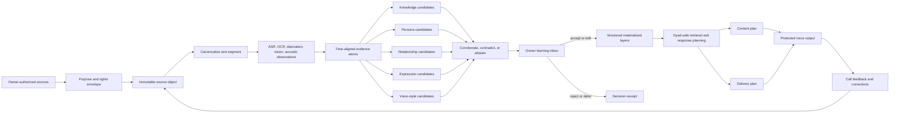

# Multimodal Human Experience Compiler

**Research date:** 2026-08-30  
**Scope:** a scalable layer that compiles owner-authorized recordings, uploaded audio and video, text, images, channel data, social media, and calls into relationship memory, stable persona, observable expression, and controllable voice delivery  
**Evidence boundary:** this is a decision and evaluation specification. It does not claim that the proposed compiler, models, source connectors, or quality gates are implemented or have passed. Current deployed facts remain in `context/STATE.md` and measured results remain in `context/measurements.md`.

## Executive verdict

The strongest path is not one model that watches and listens to everything, writes a psychological profile, and continuously retrains a clone. That design is difficult to inspect, impossible to undo cleanly, vulnerable to source errors, and unsafe for an education product.

Vyakti should build a **Human Experience Compiler** that turns every authorized source into immutable, addressable evidence, then produces separate, reviewable candidates for five different layers:

1. **Knowledge:** what the owner knows, claims, teaches, remembers, or believes at a named time.
2. **Persona:** how the owner tends to explain, decide, joke, correct, refuse, hedge, and code-switch in a named context.
3. **Relationship:** what happened between named participants, what was promised, what remains open, and which interaction pattern is supported by repeated cited events.
4. **Expression:** observable delivery and interaction features such as pace, pitch range, energy, pauses, overlap, laughter, emphasis, discourse markers, and an optional distribution of how calibrated observers may interpret a segment. This is never an assertion of inner emotion.
5. **Voice:** speaker identity plus an owner-approved repertoire of delivery styles, kept separate so stronger expressiveness cannot silently overwrite identity.

Calls can use recent evidence immediately within the session. They may propose durable facts, relationship events, persona shapes, expressive styles, or voice-reference candidates afterward. Nothing becomes durable until the owner accepts it. Every accepted change creates a new version with a parent, evidence links, an evaluation receipt, and a rollback target.

This is the product moat. Competitors expose content upload, a persona prompt, a memory key, or a voice/avatar. Vyakti can expose **why the clone believes something, where a behavior came from, which relationship may see it, what changed, and how to undo it**.

## The gap map

The repository has good primitives but not yet the compiler that joins them. The current [continuous-clone research](./CONTINUOUS-HUMAN-CLONE-FRONTIER-2026-08-29.md) and `MIRROR-CALL-SPEC.md` establish immutable call evidence, bitemporal facts, dyad state, TeacherSheet versions, protected voice generation, and reviewable Mirror Call deltas. The remaining gaps are architectural, not cosmetic.

| Gap | Why it blocks a great human clone | Required closure evidence |
|---|---|---|
| No common evidence atom across files, audio, video, images, social sources, and calls | Each lane can invent a different owner, time, participant, confidence, or consent interpretation | One typed evidence contract, one provenance DAG, and erasure reachability for every derivative |
| No production multimodal compiler | Uploads are not systematically converted into knowledge, persona, relationship, expression, and voice candidates | One source creates typed candidates in every eligible lane, each linked to exact spans and compiler manifests |
| Mirror Call does not write searchable relationship memory | A call can propose phrase habits but does not yet strengthen the dyad graph | An authenticated deployed call, one accepted relation event, successful later retrieval, rejection control, and erasure proof |
| No calibrated Hindi, Hinglish, or Indian-English expression observer | Generic emotion labels can confuse accent, speaker baseline, culture, sarcasm, or noise | Speaker-disjoint calibration, selective-risk curves, subgroup reporting, and zero inner-state assertions |
| No expression-to-delivery contract | Even correct observations do not cause the clone to speak in an owner-like, context-appropriate way | Exact delivery-plan receipt, identity floor, intelligibility gate, and blinded preference win |
| Voice identity and expressive style are not independently promoted | A more dramatic model may sound less like the owner; a high-similarity model may sound flat | Separate identity, intelligibility, style-following, naturalness, and response-appropriateness evaluations |
| No source-rights adapter for social platforms | A URL is not permission to download, analyze, or train on every person in the media | OAuth/account ownership, purpose-specific authorization, participant policy, platform-term compliance, and deletion path |
| No owner-facing learning inbox across all layers | Invisible learning becomes silent persona drift; opaque rejection provides no improvement signal | Evidence playback, accept/edit/reject/defer, impact preview, version history, and rollback in the Studio |
| No release corpus for the complete human experience | Component tests cannot prove a coherent clone across months, relationships, languages, and modalities | Owner-disjoint longitudinal benchmark with frozen sources, citations, counterfactual deletions, calls, and blinded raters |
| No production call-learning canary with transmitted audio | Session creation and readiness do not prove ASR, cited extraction, retrieval, or expressive response | A real multi-turn production canary that records, compiles, accepts, rejects, reloads, retrieves, and erases |

## What the frontier says, and what it does not

### Long-term personalization is still unsolved

[LongMemEval](https://arxiv.org/abs/2410.10813) separates extraction, multi-session reasoning, temporal reasoning, knowledge updates, and abstention across 500 curated questions. It reports about a 30 percentage-point memory drop for commercial assistants and long-context models over sustained histories. [PERSONAMEM](https://arxiv.org/abs/2504.14225) contains more than 180 simulated histories with as many as 60 sessions and finds frontier systems near 50% overall accuracy on tracking evolving user profiles. [LongMemEval-V2](https://arxiv.org/abs/2605.12493) expands the problem to 451 questions over histories as large as 500 trajectories and 115 million tokens; its best reported method reaches 72.5% and pays a latency cost.

Two 2026 benchmarks are especially relevant. [CloneMem](https://arxiv.org/abs/2601.07023) evaluates one-to-three-year personal trajectories drawn from diaries, social posts, direct messages, and email rather than chat history alone. [PersonaVLM and Persona-MME](https://arxiv.org/abs/2604.13074) evaluate 2,034 multimodal cases across memory, intent, preference, behavior, relationship, growth, and alignment. Persona-MME's dialogues average 142.9 turns and 15.87% multimodal turns. These are valuable benchmark shapes, not permission to adopt their inferred internal-state ontology as human truth.

The architectural direction is consistent across [Zep's temporal graph](https://arxiv.org/abs/2501.13956), [Mem0](https://arxiv.org/abs/2504.19413), and the above benchmarks: raw events, temporal state, consolidation, and retrieval are separate jobs. Vendor-authored benchmark gains are candidate evidence, not Vyakti results.

### User edits are a stronger learning signal than passive guessing

[CIPHER](https://arxiv.org/abs/2404.15269) infers compact, inspectable preferences from user edits and retrieves preferences from similar contexts rather than continuously rewriting one global profile. Its evaluation uses simulated users, so it is not a production guarantee. The design lesson is still directly useful: corrections should produce context-keyed behavioral shapes that owners can see and edit, not hidden weight updates or a growing transcript phrase bank.

### Multimodal foundation models are useful observers, not authorities

[Qwen2.5-Omni](https://arxiv.org/abs/2503.20215) aligns text, images, audio, and video on a shared temporal representation and can stream text and speech; the [official repository](https://github.com/QwenLM/Qwen2.5-Omni) is Apache-2.0. [Gemma 3n](https://ai.google.dev/gemma/docs/gemma-3n/model_card) accepts text, image, video, and audio and produces text. [V-JEPA 2](https://arxiv.org/abs/2506.09985) and [V-JEPA 2.1](https://arxiv.org/abs/2603.14482) provide strong visual and motion representations, with mixed MIT and Apache-2.0 surfaces in the [official repository](https://github.com/facebookresearch/vjepa2).

None of those capabilities establishes that a model can infer a person's true emotion, relationship, personality, or intent from a clip. The right deployment role is a version-pinned **candidate generator** whose assertions must cite spans and pass lane-specific validation.

### Expression recognition measures interpretations, not feelings

[emotion2vec](https://arxiv.org/abs/2312.15185) learns speech-expression representations and performs well on standard speech-emotion tasks after a linear head. [SenseVoice](https://github.com/FunAudioLLM/SenseVoice) combines ASR, language identification, speech-expression labels, audio events, and, in its 2026 release, diarization. Its source code is MIT, while official weights have separate FunASR terms and attribution requirements. Neither source is evidence of a calibrated Hindi/Hinglish production observer for Vyakti.

Culture and speaker calibration are not optional. [CuLEmo](https://aclanthology.org/2025.acl-long.925/) contains 400 questions per language across six languages including Hindi and reports large language and cultural differences. A broad [LREC-COLING review](https://aclanthology.org/2024.lrec-main.506/) identifies missing cultural and demographic treatment and poor agreement on emotion taxonomies. A 2025 cross-lingual study improved macro-F1 from 0.619 to 0.753 by adapting to the individual speaker at inference time, illustrating how a speaker's own vocal range can change classification ([ACL Anthology](https://aclanthology.org/2025.poleval-main.12/)).

Hume's official guidance states the correct epistemic boundary: its scores estimate how observers may interpret expressive cues and do not imply the speaker is experiencing the named emotion. It also warns against top-label reduction and requires population-specific validation ([FAQ](https://dev.hume.ai/docs/speech-to-speech-evi/faq), [use-case guidelines](https://dev.hume.ai/docs/resources/use-case-guidelines)). Vyakti should adopt this boundary regardless of which model it uses.

### Human voice interaction needs more than ASR and TTS scores

[VoiceBench](https://arxiv.org/abs/2410.17196) evaluates voice assistants under speaker, environment, and content variations. [Talking Turns](https://arxiv.org/abs/2503.01174) adds user studies and supervised judging for interruptions, overlap, silence, and backchannels, finding that current systems interrupt aggressively and rarely backchannel. [ParaS2S](https://arxiv.org/abs/2511.08723) separates paralinguistic understanding from appropriate content and style responses. These benchmarks justify a call scorecard with temporal dynamics, behavioral arbitration, semantics, acoustic quality, and safety, not one latency or naturalness number.

## The compiler architecture



### 1. Purpose and rights envelope

Every source is admitted for named purposes rather than one blanket “clone me” permission:

- transcribe content;
- derive knowledge candidates;
- derive persona or communication-style candidates;
- derive relationship candidates;
- measure observable delivery;
- use owner-only voice segments for identity or style conditioning;
- use within the current call;
- retain for later review;
- train or fine-tune a named model;
- publish synthetic output.

The envelope records the owner, acquisition method, platform account, claimed rights, present participants, applicable notices, allowed processors, retention, jurisdiction, and revocation. Each downstream object inherits the intersection of its parents' permissions. Combining two sources can never broaden permission.

India's [Digital Personal Data Protection Act, 2023](https://www.meity.gov.in/static/uploads/2024/02/Digital-Personal-Data-Protection-Act-2023.pdf) requires consent to be free, specific, informed, unconditional, unambiguous, purpose-limited, and as easy to withdraw as to grant. It also provides correction and erasure rights. The final [Digital Personal Data Protection Rules, 2025](https://www.meity.gov.in/static/uploads/2025/11/53450e6e5dc0bfa85ebd78686cadad39.pdf) require an independently understandable notice with itemized personal data and specified purposes, although major operational rules have staggered commencement dates. The product should meet the stricter shape now rather than wait for the last commencement date.

### 2. Immutable source object

The source object holds encrypted bytes or an authorized external handle, a content hash, media metadata, source type, ingestion receipt, and consent envelope. It never stores only an LLM summary. For a long recording, every second ends in one of four accountable states:

- accepted speech or visual evidence;
- excluded because it belongs to another participant;
- unusable with a named quality reason;
- intentionally unprocessed by policy.

This accounting prevents a “processed” badge from hiding dropped audio, unexamined frames, missing pages, or a failed transcript.

### 3. Canonical segments and evidence atoms

An evidence atom is the smallest addressable observation that later claims can cite. Its minimum contract is:

```text
evidence_id
owner_id, replica_id
source_id, source_version
participant_id or unresolved_speaker_id
dyad_id or null
modality and observation_kind
start_ms, end_ms, page, region, or message_id
captured_at, mentioned_at, valid_from, valid_to
language, script, code_switch_spans
verbatim transcript or OCR plus confidence
observable feature payload
content_hash and parent_hashes
rights_envelope_id and allowed_purposes
compiler_manifest_id
created_at, expires_at, erased_at
```

The compiler manifest binds exact model revisions, licenses, prompts, decoding parameters, normalizers, thresholds, and code commit. Recompilation creates new evidence versions and never overwrites the prior interpretation.

### 4. Candidate contract

Every candidate in every layer uses one shared envelope:

```text
candidate_id, lane, subject, predicate, object
context_scope, dyad_scope, audience_scope
valid_from, valid_to
supporting_evidence_ids[]
contradicting_evidence_ids[]
quality_vector
model_interpretation and owner_wording
state: proposed | accepted | edited | rejected | deferred | superseded
reviewed_by, reviewed_at, rejection_reason
materialized_version_id or null
```

`quality_vector` is deliberately not one confidence number. It contains source integrity, speaker attribution, transcript/OCR confidence, extraction confidence, cross-source support, temporal certainty, cultural calibration slice, and reviewer status. A confident transcript cannot repair uncertain speaker attribution. Five reposts of one clip do not count as five independent sources.

### 5. Versioned materialization

Accepted candidates produce typed, immutable versions:

- Person/TeacherSheet version;
- owner knowledge view;
- relationship state per dyad;
- expression policy and style atlas;
- VoiceGenome/reference-set version;
- retrieval index version.

Each version binds its parent, accepted candidates, compiler manifests, release evaluation, and activation time. Rollback moves the active pointer to a prior version. Erasure removes source bytes and walks every derivative edge; it then builds a new valid version from remaining evidence rather than leaving an invisible hole.

## What each source may teach

More data helps only if its lane, speaker, context, rights, and quality are correct. The compiler should reject the idea that every source teaches every layer.

| Source | Strong signals | Weak or unsafe inferences | Admission rule |
|---|---|---|---|
| Guided or free owner recording | Speaker identity, clean acoustic baseline, lexical habits, code-switching, owner-labeled delivery styles | Relationships, stable personality, or inner emotion from one monologue | Owner voice verification; direct recording is the default primary identity source |
| Uploaded owner audio | Identity and style when the owner is verified; content, facts, and preferences from transcript | Treating every speaker as the owner; training on background voices | Diarize, owner-match each segment, and exclude other speakers from voice learning |
| Uploaded video | Audio evidence plus gestures, board use, visual demonstrations, scene context, and speaking style | Personality or relationships from appearance; facial “emotion truth” | Time-align audio and video; store visible observations; sensitive inference deny-list |
| Text, documents, chats, email | Knowledge, explicit opinions, chronology, written style, named commitments | Voice identity, spoken prosody, or certainty that an unverified author is the owner | Preserve author and message boundaries; third-party content receives separate privacy scope |
| Images and screenshots | OCR, visible objects, setting, board content, attire chosen for a context, repeated visual presentation patterns | Emotion, trust, personality, protected attributes, or relationship type from co-occurrence | Candidate facts only; owner labels people and context before any relation claim |
| Owner YouTube channel | Authorized video inventory, metadata, and owner-editable caption tracks | Arbitrary audio extraction through the Data API or cloning every visible/audible person | OAuth account binding; use owner-uploaded originals or authorized captions; no scraping |
| Owner Instagram | Professional-account media available through official permissions; owner captions and authorized media | Consumer-account scraping, comments as consent to profiling, or other people's faces/voices as clone data | Official account connection where supported; otherwise direct account export or file upload |
| Arbitrary web/social URL | Public text or metadata when terms and robots permit; a link back to source | A license to download media, train a voice, identify people, or persist third-party data | Connector-specific policy; unsupported sources stay links, not silently scraped evidence |
| Live or uploaded call | Current dyad events, corrections, commitments, phrase habits, turn timing, session-scoped delivery cues | Permanent emotion/personality from a moment; second participant's speech as owner voice | Participant notice and purpose controls; source-bound proposals; no silent durable update |

YouTube is a hard product constraint. The [YouTube API Developer Policies](https://developers.google.com/youtube/terms/developer-policies) prohibit downloading, importing, caching, or storing audiovisual content without prior written approval and prohibit offering separated audio tracks. OAuth can identify the owner's channel ([authorization guide](https://developers.google.com/youtube/v3/guides/authentication)), and an authorized user with permission to edit a video can download that video's caption track ([captions.download](https://developers.google.com/youtube/v3/docs/captions/download)). Therefore the compliant channel route is:

1. OAuth-bind the owner and enumerate their uploads.
2. Import authorized captions and metadata for knowledge/persona candidates.
3. Ask for the original media upload when voice, timing, or visual expression is required.
4. Keep every imported item owner-visible and deletable.

Instagram's official Meta-published API collection supports professional Business and Creator accounts and states that the Facebook-login path cannot access consumer accounts ([official Meta Postman collection](https://www.postman.com/meta/instagram/documentation/6yqw8pt/instagram-api)). Meta also states that automated access without permission violates its terms ([Meta scraping guidance](https://about.fb.com/news/2021/04/how-we-combat-scraping/)). The practical product route is official OAuth for supported professional accounts and user-provided exports/uploads for consumer accounts, not headless scraping.

## The five compilers

### Knowledge compiler

The knowledge compiler extracts explicit facts, teachings, opinions, plans, and claims. It preserves whether the owner asserted, quoted, speculated, taught, or later contradicted something. Dates have three meanings and should not be collapsed:

- when the source was captured;
- when the described event occurred;
- when the claim was valid.

The compiler can propose “the owner preferred method A in August 2026.” It cannot silently turn that into “the owner always prefers method A.” A summary is a retrieval view over evidence, never the evidence itself.

### Persona compiler

The persona layer stores context-conditioned behavioral shapes, not psychological diagnoses and not quotable example sentences. Candidate dimensions include:

- explanation order and level of detail;
- how uncertainty is expressed;
- first move when correcting someone;
- use of examples, analogies, questions, or board work;
- humor form and when it is appropriate;
- formality, honorifics, code-switch ratio, and script choice by audience;
- disagreement, refusal, apology, repair, and boundary patterns;
- sentence length, discourse markers, filler candidates, and pacing tendencies;
- pedagogical strictness and warmth only as owner-approved interaction settings, not inferred traits.

A pattern needs repeated, independent support and context. A lecture proves lecture behavior. It does not prove how the owner speaks to a parent, friend, partner, or distressed student. CIPHER's context-keyed preference retrieval is the correct template; one global personality paragraph is not.

### Relationship compiler

There are three graphs and they must never be merged implicitly:

1. **Owner self graph:** the owner's roles, values, commitments, and explicit relations.
2. **Owner-to-listener dyad graph:** shared episodes, promises, rituals, corrections, boundaries, and unresolved threads between the clone and one listener.
3. **Mentioned third-party graph:** people and relationships described in owner sources but not verified as platform identities.

The event ontology should stay observable:

- role asserted or confirmed;
- shared episode;
- request, promise, completion, or missed commitment;
- preference or boundary explicitly stated;
- teaching question, misconception, correction, and later mastery;
- gratitude, praise, apology, conflict, and repair as speech acts;
- recurring ritual or interaction pattern supported by at least two independent events;
- open loop with owner, participant, due time, and status;
- uncertainty or contradiction requiring review.

“Trust,” “closeness,” or “rupture” may be materialized interaction-policy views if the repository retains them, but they must be recomputable from cited events and never be exported as clinical or psychological scores. Retrieval always begins with `{owner, replica, listener/dyad, audience, valid_time}` before semantic search. A relevant fact from the wrong dyad is a privacy failure, not a retrieval near miss.

### Expression compiler

The expression compiler has four epistemic tiers:

1. **Direct acoustics:** voiced duration, speaking rate, pause distribution, pitch median/range/contour, energy, spectral balance, breathiness proxies, laughter, sigh/cough events, overlap, and turn timing.
2. **Linguistic delivery:** discourse markers, elongation, repetition, emphasis, hedging, directness, code-switch position, and syntactic rhythm.
3. **Interaction behavior:** interruption, backchannel, response timing, repair, escalation/de-escalation, and whether a cue changed the next response.
4. **Observer interpretation distribution:** optional calibrated probabilities such as “often heard as amused” with model, population, context, and uncertainty. Never “the person is amused.”

Production should begin with tiers 1 to 3. The learned observer tier stays shadow-only until Hindi, Hinglish, and Indian-English calibration passes. Do not ship openSMILE binaries commercially under the public license; the [official license](https://github.com/audeering/opensmile/blob/master/LICENSE) excludes commercial use without an additional license. Either obtain that license or implement the selected feature definitions with commercially compatible dependencies and verify numerical equivalence.

For the edtech deployment, do not infer student emotion from voice or face. Article 5(1)(f) of the [EU AI Act](https://eur-lex.europa.eu/legal-content/en/TXT/?uri=CELEX%3A32024R1689) prohibits emotion inference in workplaces and education institutions except for medical or safety reasons. Article 50 separately requires notice where permitted emotion-recognition systems are used and requires synthetic media disclosure ([consolidated text](https://eur-lex.europa.eu/eli/reg/2024/1689/2026-07-27/eng)). A globally scalable product should use explicit student language such as “I am confused,” user-selected interaction settings, and neutral turn-taking mechanics. Legal counsel still needs to review every launch jurisdiction.

### Voice and delivery compiler

The voice layer needs two independent artifacts:

- **Identity anchor:** verified clean speech optimized for speaker likeness and intelligibility.
- **Style atlas:** owner-approved clips or learned clusters representing contexts such as explaining, questioning, joking, correcting, reflecting, encouraging, and firm refusal.

The atlas labels contexts before emotions. The owner can rename clusters in their own language. For each cluster, store distributions rather than one “perfect” clip: pace, pause, pitch, energy, lexical markers, code-switch behavior, and usable reference windows.

Every response produces two plans:

```text
content_plan:
  allowed claims, citations, relationship scope, uncertainty, safety actions

delivery_plan:
  owner_style_id, pace_range, pause_shape, emphasis_spans,
  pitch/energy bounds, code_switch/register, interruption policy,
  identity_floor, intelligibility_floor
```

The synthesizer receives a bounded delivery plan and one approved identity/style condition. It does not receive a prose emotional biography. Generated audio binds the content plan, delivery plan, source references, voice artifact, model revision, disclosure, watermark, and protection receipt.

### Cross-source corroboration

The fusion stage never averages all models or treats repetition as truth. It performs:

- exact and near-duplicate clustering before support counting;
- speaker/author resolution with an unresolved state;
- temporal ordering and supersession;
- independent-source counting;
- support and contradiction edges;
- context compatibility checks;
- minimum evidence requirements by lane;
- abstention when a candidate cannot be grounded.

One explicit owner correction outweighs many passive guesses for future behavior, but it does not rewrite history. The old evidence remains and the accepted correction becomes a newer valid-time event.

## Calls as a continuous evidence source

### Hot path

During a call, only bounded session state affects the next turn:

- current and recent transcripts with confidence;
- speaker attribution;
- current open question or action;
- neutral turn-taking cues;
- approved persona and relationship state;
- relevant cited memories;
- an owner-approved delivery style.

Session observations expire unless converted into candidates. A low-confidence ASR hypothesis never writes a fact. A long pause may guide turn-taking but does not become “the student is sad.” The clone does not mirror agitation or raise intensity because the user sounded intense.

### Nearline compile

After each finalized window or at call end, the compiler can propose:

- corrected transcript spans;
- facts and commitments;
- relationship events and open loops;
- persona or phrase-shape candidates;
- owner voice/style windows if owner attribution passes;
- response-quality feedback linked to the exact turn.

The call summary must show what was captured, dropped, proposed, and retained. “Learning” is complete only when a named candidate exists. “Improved” is complete only after approval, materialization, evaluation, and activation.

### Durable promotion

The owner accepts, edits, rejects, or defers each candidate. Accepted candidates are replayed through the same offline evaluation pack as upload-derived candidates. A voice reference or adapter is promoted only if it beats the current artifact on its named target without breaking identity, intelligibility, safety, or protected delivery.

## Retrieval and response assembly

The retrieval planner should use ordered filters rather than global vector similarity:

1. ownership and replica;
2. listener/dyad and audience scope;
3. allowed purpose and disclosure policy;
4. valid time and supersession;
5. query intent and lane;
6. lexical, dense, temporal, and graph retrieval;
7. contradiction and uncertainty check;
8. evidence sufficiency;
9. context-budget selection.

The response planner receives evidence packets, never database-shaped dumps or uncited summaries. Each packet includes the proposed response implication and citations. Missing evidence yields abstention or a question. The output path records which evidence and relationship version actually affected the answer.

## Product experience

### Source map

Every clone gets one source map with cards for recordings, audio/video, text, images, YouTube, Instagram, other links, and calls. Each card shows:

- owner/participant attribution;
- allowed purposes;
- processed coverage as exact seconds, pages, frames, or messages;
- current stage and honest failure reason;
- what the source contributed to each layer;
- what was excluded and why;
- delete and reprocess actions.

Do not show one “human clone 74% complete” number. There is no finite denominator for personhood. Show evidence counts and missing evaluation cells instead.

### Learning inbox

The inbox groups cards into Knowledge, Persona, Relationships, Expression, and Voice. Every card answers:

- What did the system notice?
- From which exact source and span?
- Is this a direct observation, model interpretation, or owner statement?
- Where would it be used?
- Who could it affect or disclose to?
- What changes if accepted?

Actions are Accept, Edit and accept, Reject, Not enough evidence, and Never infer this. Rejection reasons train the compiler evaluation set but do not become persona content automatically.

### Scenario calibration

The owner previews the clone in role-specific scenarios such as “explaining to a student,” “answering a peer,” “correcting a misconception,” and “responding to a close friend.” They compare current versus candidate versions blindly, correct text or re-record delivery, and publish only after the relevant cells pass.

### After-call receipt

After a call, show:

- transcript and speaker attribution;
- reply/citation receipts;
- proposed relationship and persona changes;
- delivery observations and uncertainty;
- accepted/rejected state;
- exact retention and deletion controls.

Nothing is labeled “trained” unless model weights or a promoted adapter actually changed and a training receipt exists.

## Product frontier comparison

| Product/system | First-party evidence | Useful lesson | Vyakti opportunity |
|---|---|---|---|
| Delphi | Content upload builds a digital mind; a required voice recording is also used to separate the owner's voice from other uploaded audio ([content docs](https://docs.delphi.ai/using-delphi/mind/content-upload), [voice docs](https://docs.delphi.ai/identity/voice)) | Source ingestion and owner-voice attribution belong in one onboarding flow | Expose exact evidence, candidate state, relationship scope, evaluation, and rollback rather than only a trained result |
| Tavus | Cross-conversation memories use stable `memory_stores`; official docs warn that reusing an ID causes memory crossover and state that memory review/edit is not yet available ([FAQ](https://docs.tavus.io/sections/conversational-video-interface/faq)) | Stable participant keys are mandatory for continuity | Make memories inspectable, editable, evidence-cited, dyad-scoped, and erasable from day one |
| Character.AI | Users can pin five messages per chat in the documented Pinned Memories feature ([official help](https://support.character.ai/hc/en-us/articles/24327914463003-New-Feature-Pinned-Memories)); later Chat Memories adds an explicit free-text memory space ([official post](https://blog.character.ai/helping-characters-remember-what-matters-most/)) | Manual memory control is understandable and useful | Combine that control with automatic cited proposals and typed temporal/dyadic state |
| Personal AI | The Memory Stack is a browsable store of recorded memories ([official docs](https://product-docs.personal.ai/training-your-ai/memory-stack)) | The user needs a visible personal data asset, not only model behavior | Add per-source provenance, relationship isolation, version activation, and output receipts |
| Hume EVI | Speech-language response uses expression measurements, language, end-of-turn behavior, interruptibility, and expressive synthesis; Hindi is listed for EVI 4-mini ([official overview](https://dev.hume.ai/docs/speech-to-speech-evi/overview)) | Expression can improve response content and delivery in real time | Use it as a sealed opt-in benchmark arm while preserving owner-controlled memory and clone identity |

The differentiator is not “we ingest more.” It is **a visible, reversible compilation from evidence to behavior**.

## Candidate components and licensing boundary

| Component | Role | License/terms fact | Decision |
|---|---|---|---|
| Qwen2.5-Omni 3B/7B | Multimodal candidate extraction over audio/video/images/text | Apache-2.0 in the official repository | Shadow compiler arm; require span-grounding and language-specific eval before any authority |
| Gemma 3n | Small multimodal local observer | Open weights under Google's Gemma terms, not automatically Apache-2.0 because docs code samples are Apache | Shadow arm where deployment terms are accepted and recorded |
| V-JEPA 2/2.1 | Visual and motion embeddings, scene/change selection | Official repository contains MIT and Apache-2.0 surfaces | Optional video feature/selection arm, not persona or emotion authority |
| pyannote Community-1 | Speaker diarization | Official model card lists CC-BY-4.0; official docs state no Community-1 voiceprint identification | Diarization candidate; owner identity still needs a separate verified speaker matcher |
| SenseVoice | ASR, language, audio events, expression representation, diarization | MIT code; model weights under separate FunASR terms with attribution/model-name requirements | Research/shadow until exact weights, dependencies, Hindi/Hinglish calibration, and commercial record pass |
| emotion2vec | Speech-expression representation | Research model and task heads require exact artifact/license review | Representation research only; never use an uncalibrated top label as durable state |
| openSMILE | Handcrafted acoustic feature extraction | Public license excludes commercial use without an additional license | Do not ship binaries without a commercial license; use a compatible implementation or alternative |
| Hume | Vendor expression and expressive response baseline | Proprietary API, retention and contractual controls apply | Sealed, purpose-specific, opt-in benchmark arm only |

No one component can write accepted facts, relationships, persona, or voice state directly.

## Exact evaluation protocol

The clone must pass a multidimensional scorecard. There is no scientifically defensible single “human likeness percentage.”

### Evaluation population and splits

Before general release, collect an owner-disjoint, consented evaluation set with at least **30 speakers per primary register**: Hindi, Hinglish, and Indian English. Each register cell must contain diverse self-reported regions, ages, genders, microphones, and acoustic conditions without inferring those attributes. Each owner contributes:

- three 30-to-60-second clean recordings in different owner-labeled delivery styles;
- one noisy recording and one multi-speaker recording;
- at least two 10-minute calls with different consented partners or synthetic counterparts;
- two long-form audio/video sources of at least 15 minutes;
- at least 20 text traces across at least three contexts;
- at least ten images/screenshots with owner-provided descriptions;
- explicit corrections, contradictions, and one requested deletion.

Train/calibration/test splits are speaker-disjoint and source-family-disjoint. At least three independent annotators label every subjective item. Report bootstrap 95% confidence intervals and every language/register cell separately. Synthetic histories may expand scale but cannot replace human owner/listener ratings.

### Ingestion and evidence gates

| Measure | Protocol | Promotion gate |
|---|---|---|
| Coverage accountability | For every test source, compare total seconds/pages/messages/regions with accepted, excluded, unusable, and policy-skipped units | 100% accounted; no silent remainder |
| ASR | Human transcripts; raw WER/CER, transliteration-aware WER for Hinglish, named-entity recall, clear/noisy/overlap cells | Clear-speech median transliteration-aware WER at most 12%; p90 at most 25%; named-entity recall at least 95%; no register hidden in aggregate |
| Diarization | Human speaker turns; DER, JER, overlapped-speech miss, owner-attribution precision/recall | Median DER at most 8% and p90 at most 20%; owner-attribution precision at least 99% for any voice-training eligible segment |
| Time alignment | Human span boundaries for speech, OCR, gestures, and visual events | Median boundary error at most 500 ms; temporal IoU at least 0.70 for retrieved video spans |
| OCR/visual facts | Human transcription and visible-fact annotations; precision, recall, unsupported-claim rate | Printed-text CER at most 5%; visible-fact precision at least 95%; zero protected-attribute or inner-state candidates |
| Provenance | Random sample plus automated reach walk | 100% of candidates resolve to source spans and compiler manifests |
| Erasure | 100 randomized source deletions including accepted candidates and active versions | Zero reachable source bytes, embeddings, candidates, indexes, or model adapters after the retention window; new active version excludes them |

Thresholds above are release targets, not achieved measurements. If a register misses, that register remains off rather than borrowing another language's aggregate.

### Knowledge and memory gates

Build at least 600 questions over 30 consented or synthetic owner histories, balanced across direct extraction, multi-session, temporal, update, contradiction, abstention, future plan, and source deletion. Add CloneMem-shaped one-to-three-year digital traces and Persona-MME-shaped multimodal cases.

Report:

- answer accuracy and exact evidence recall;
- citation precision and citation completeness;
- stale-state error after updates;
- correct abstention when evidence is absent or contradictory;
- cross-owner and cross-dyad disclosure;
- latency, retrieved bytes/tokens, and cost;
- accuracy before and after deleting one supporting source.

Promotion requires **100% citation precision**, at least **95% abstention accuracy**, at least **85% overall answer accuracy with no category below 75%**, stale-state error at most **2%**, and **zero cross-owner or cross-dyad disclosures in 100,000 adversarial retrieval probes**. A new retrieval system must beat the current one by at least 5 absolute points or reduce p95 latency/cost by at least 25% with no quality or privacy regression.

### Persona and relationship gates

Use 25 PersonaGym-shaped situations per register, three seeds, and evaluation at turns 1, 8, 22, and 44 plus a later session. Add adversarial praise, pressure, transient delivery shifts, contradictory sources, and second-participant attempts to rewrite the owner.

For relationships, create at least 40 dyads with shared events, promises, boundaries, rituals, conflicts, repairs, teaching mistakes, and intentionally similar facts in other dyads. Score event extraction, temporal state, action relevance, and disclosure.

Promotion requires:

- zero unapproved durable updates in 10,000 candidate/retrieval sequences;
- 100% byte-identical rollback to the prior active version;
- relationship-event precision at least 90% and recall at least 80%;
- repeated patterns backed by at least two independent cited events;
- zero cross-dyad disclosure in the adversarial pack;
- candidate-version paired preference lower 95% confidence bound above 0.50;
- no more than 0.25 points worse than the frozen baseline on any five-point persona axis.

### Expression-understanding gates

Gold labels are observer interpretations with context and self-report as a separate field. They are never ground-truth inner emotion. Evaluate acoustics-only, self-hosted representation, multimodal model, and sealed-vendor arms on speaker-disjoint clips.

Report macro-F1/UAR, Brier score, expected calibration error, selective risk versus coverage, inter-rater agreement, culture/register slices, acoustic-condition slices, and response appropriateness. Add an adversarial set where text and delivery conflict, acted speech, sarcasm, background voices, and non-speech events.

Promotion requires:

- zero certain inner-state claims;
- expected calibration error at most 0.10 in every enabled register;
- selective error at most 15% at at least 50% coverage in every enabled register;
- no enabled subgroup more than 0.10 absolute error worse than the best subgroup;
- response-appropriateness paired preference lower 95% bound above 0.50;
- zero use of biometric emotion inference on students in education deployments.

If these gates are not met, retain only direct acoustics, linguistic delivery, interaction timing, and explicit self-report.

### Voice identity and expressive delivery gates

For every candidate, freeze 20 exact-text prompts per register, three seeds, one verified identity reference per cell, at least three owner-approved style references, and at least five blinded listeners per stimulus. Evaluate:

- owner-likeness MOS and same/different ABX;
- non-owner impostor ABX;
- WER/CER and pronunciation;
- naturalness MOS;
- style similarity and instruction following;
- response appropriateness in dialogue context;
- identity retention under every style;
- watermark, audible disclosure, and provenance receipt.

Promote only if the candidate's paired owner/listener preference has a lower 95% bound above 0.50, WER is no more than two absolute points worse than the incumbent, no style cell falls below the registered identity floor, and 100% of delivered clips carry the required protection. Speaker embeddings remain diagnostic proxies, never the perceptual winner.

### Call gates

Run at least 30 deployed sessions in every cell of this matrix:

- Hindi, Hinglish, Indian English;
- desktop and phone;
- strong, degraded, and interrupted networks;
- warm and cold runtime;
- quiet and noisy environments.

Report speech-end to first audible response, full response latency, interruption-to-audio-stop, barge-in recall/false positives, overlap, long silence, backchannel appropriateness, ASR corrections, tool-call accuracy, say/do consistency, retrieval citation, relationship continuity, expression appropriateness, protected delivery, failure recovery, and cost.

Release targets are p95 interruption-to-audio-stop at most 250 ms, valid barge-in recall at least 95%, false barge-in at most 2%, warm speech-end-to-first-audio p50 at most 900 ms and p95 at most 1.5 s, 100% tool say/do consistency, 100% protected output, and zero accepted changes before an owner action. Cold-start time is reported separately and never blended into warm conversational latency.

## Staged implementation order

### Stage 0: freeze the ontology and policy engine

Define evidence atoms, candidate lanes, rights envelopes, compiler manifests, relation-event ontology, expression vocabulary, version receipts, and erasure edges. Add negative controls before extraction code.

**Exit:** a machine-readable manifest validates every type, permission inheritance, state transition, and deletion edge.

### Stage 1: one canonical source compiler

Make direct recording, uploaded audio/video, text/documents, images, and Mirror Call emit the same evidence atoms. Reuse existing private source and erasure infrastructure. Do not add social connectors yet.

**Exit:** one mixed source pack reaches accountable segments with exact provenance; no candidate writing.

### Stage 2: shadow multimodal candidates

Run deterministic acoustic/interaction features plus pinned ASR, diarization, OCR/vision, and one multimodal LLM arm. Store candidates and disagreement, but change nothing durable.

**Exit:** ingestion/evidence gates and Hindi/Hinglish calibration reports exist.

### Stage 3: learning inbox and version compiler

Ship review cards, evidence playback, accept/edit/reject/defer, “never infer this,” impact preview, materialization, rollback, and erasure.

**Exit:** a source can propose all eligible lanes, only accepted candidates materialize, rollback is byte-identical, and deletion removes every derivative.

### Stage 4: relational retrieval

Connect accepted call/upload relationship events to the existing episode/fact/pattern/rel-state system. Enforce owner, replica, dyad, audience, and valid-time filters before semantic retrieval.

**Exit:** relationship-memory benchmark passes and a deployed call demonstrates accepted retrieval plus rejected and deleted negative controls.

### Stage 5: expression-aware response planning

Use explicit language, neutral turn-taking, approved owner styles, and session-only observations to select a delivery plan. Keep learned observer labels shadow-only until calibration and jurisdiction gates pass.

**Exit:** blinded response appropriateness improves with no new inner-state claims, privacy failures, persona drift, identity loss, or intelligibility regression.

### Stage 6: owner style atlas and offline voice promotion

Cluster eligible owner windows, let the owner label/rename examples, evaluate identity and style independently, and promote a style atlas or adapter only offline.

**Exit:** the full voice identity/expression pack passes and every artifact is reversible.

### Stage 7: lawful channel connectors

Add YouTube OAuth metadata/captions first, then original-file handoff. Add Instagram professional OAuth where supported and exports/uploads for consumer accounts. Every connector receives its own terms, rights, retention, revocation, and deletion test.

**Exit:** a connected source can be revoked and all imported/derived data disappears without affecting independent uploads.

### Stage 8: full-duplex research only after the cascade wins

Compare an end-to-end speech model only after the cascade has passed memory, persona, relationship, expression, protection, language, and latency gates. A full-duplex model must preserve the compiler's evidence and approval boundaries.

## Decisions and reversal conditions

1. **Build an event-sourced compiler, not an omniscient multimodal profile.** Reverse only if an end-to-end system demonstrates equal provenance, permission inheritance, dyad isolation, rollback, erasure, calibration, and quality across the full release corpus.
2. **Separate knowledge, persona, relationship, expression, and voice.** Reverse only if a unified representation improves every named metric and can still be independently inspected, scoped, deleted, and rolled back.
3. **Treat emotion-model output as observer interpretation, never inner state.** Reverse only if a scientifically and legally validated construct exists for a named population and use, with explicit consent and no education/workplace prohibition. Do not expect this reversal for student emotion inference.
4. **Use explicit owner corrections as the highest-value learning signal.** Reverse only if passive inference consistently beats owner-reviewed updates in blinded longitudinal evaluation without increasing drift or correction burden.
5. **Keep calls hot-path adaptive but durable-learning gated.** Reverse only if online weight updates can be attributed, evaluated before activation, rolled back atomically, and erased per source without interrupting a call.
6. **Use official social connectors or owner-provided files, never generic scraping.** Reverse only with platform permission, rights analysis, participant controls, and equivalent revocation/deletion guarantees.
7. **Do not expose a single human-likeness percentage.** Reverse only if one scalar is prospectively validated against every independent failure axis and cannot hide an identity, memory, privacy, expression, or safety regression.

## The first falsifiable milestone

The next milestone should be:

> One owner uploads a recording, a multi-speaker audio/video, text, and images; connects an authorized channel or uploads its original media; completes a real call; sees exact evidence and candidates across all five layers; accepts, edits, rejects, and deletes examples; publishes a new version; later interactions retrieve only the accepted dyad-safe state and speak with an owner-approved delivery style; rollback and source deletion restore the previous behavior with no orphaned data.

That outcome is smaller than “the greatest human clone,” but it is measurable, scalable, and difficult for a content-upload-plus-prompt product to imitate. Every later model or connector should earn its place by improving a named score without weakening provenance, consent, identity, relationship isolation, reversibility, or owner control.
