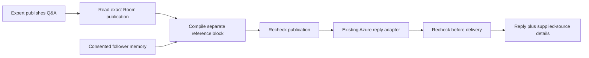

# Published answers in expert conversations

An expert's existing published showcase answers now enter ordinary Room replies. This is a small, explicit publication scope: at most five Q&As, separate from each follower's private memory. It does not publish private uploaded files or owner conversations.

The reader binds Room, owner, replica and agent, requires publication and an unpaused Room, and excludes removed answers. Read failures stop the reply instead of silently returning a generic answer. The compiler preserves complete source text within explicit transport bounds, rejects oversized input, and keeps public knowledge outside shared-past evidence. PostgreSQL and compiler character limits count Unicode characters consistently; transport budgets still count actual serialized JavaScript strings.

The source panel distinguishes answers supplied for an immediate reply from the current public catalog used as a history fallback. Supplied-source details bind the whole returned reply with SHA-256. They do not claim which sentence used which answer, establish document lineage, or verify answer correctness.

## Evidence recorded September 7, 2026

- Reader: 19 grouped checks with guard mutations.
- Compiler: 30 checks and 83 unchanged incumbent fixtures.
- Room integration: 11 groups through the actual compiler and Azure adapter with injected transport, not live inference.
- Isolated development database: 13 real scenarios including EXPLAIN, isolation and changed publication; generated fixture rows cleaned to zero.
- Independent development relational sweep: 34 checks passed.
- Forced TypeScript and 54 locale checks passed; TypeScript passed again after the history-refresh UI correction. Eight actual-callback regression groups cover source-detail retention and stale conversation responses, with guard-removal controls. These are not a signed-in browser test.

The publication rechecks bound observed changes before dispatch and delivery. They cannot retract data already transmitted to the model, and they are not an atomic transaction spanning inference. No production migration or deployment was performed. Real multilingual answer quality, owner voice likeness, and complete fresh enrollment remain unaccepted. The most recent full release attempt was incomplete; focused results do not substitute for a fresh frozen release.
