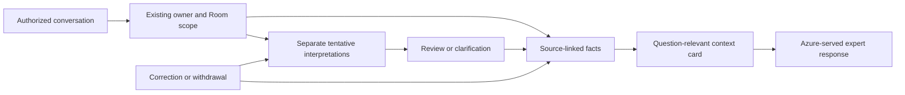

# Honcho and Vyakti: what to adopt

Reviewed 29 September 2026. Recommendation: use Honcho as a serious memory
baseline and evaluate its useful mechanisms against our existing system. Keep
the current product working while doing that comparison. No Honcho service,
plugin, model or SDK was installed; no customer conversation was sent to it.

## The useful product idea

An expert's AI should remember that a particular learner prefers Hinglish,
understand which project they are discussing, notice when a previous preference
changes, and pick up an unfinished conversation. It should also be able to show
the source of a memory and let the person correct it.

Honcho's approach is relevant because it maintains representations of changing
participants and reasons over their history. Its observation settings also
distinguish an entity's own representation from what another participant has
observed about it. That is useful for Vyakti's private relationships, provided
we preserve our stricter Room and ownership boundaries. [Overview](https://honcho.dev/docs/v3/documentation/introduction/overview),
[peer representations](https://honcho.dev/docs/v3/documentation/core-concepts/representation).

For example: a learner previously requested detailed Hindi explanations, but
now says, “Aaj sirf short English answer.” The next answer should follow today's
request without silently overwriting the learner's enduring preference. If they
say the old preference has permanently changed, the remembered preference should
change with traceable evidence. This is our proposed acceptance example, not a
measured Honcho result.

## What we already have

| Capability | Existing Vyakti implementation | Implication |
| --- | --- | --- |
| Private relationship boundaries | `api/_room-memory-authority.js`: follower/Room/agent/person/epoch checks and owner-specific authority | Retain these boundaries around any alternative memory engine. |
| Background learning | `api/_room-memory-consolidation.js`: Azure model routing, leases, metered extraction, owner and follower paths | We already have a worker pattern; replacing it is not automatically an improvement. |
| Correction and forgetting | `ROOM_MEMORY_CORRECT_SQL`, `ROOM_MEMORY_RETRACT_SQL`, owner equivalents, source/replica erasure | A replacement must propagate corrections and withdrawals into its derived representations. |
| Hindi/Hinglish preferences | `api/_learner-communication-contract.js`, `src/engine/learnerCommunication.ts` | Explicit language, script and brevity choices already have attribution and negation rules. |
| Bounded reply context | `selectExpertPrivateMemoryRows` in `src/engine/expertTextCompiler.ts` | It preserves communication support within the envelope, then fills in input order. |
| Personal identity | HumanOS sheet and `src/engine/privateExpertRehearsal.ts` person projection | Creator-approved identity must stay separate from learner memory or inferred hypotheses. |

Source inspection found a concrete candidate for improvement: owner recall
selects the newest 30 eligible facts. This may omit an older fact relevant to
the current question. It is a candidate-pool limitation, not a measured model
failure; other profile/source context may still supply the answer. Test it
before replacing retrieval.

## Three changes worth evaluating

1. **A compact context card per relationship.** Keep approved identity,
   current explicit preferences, active goals, unfinished work and supporting
   source IDs together. Select for the current question within a fixed token
   budget. Add freshness/version information so stale background work is visible.
2. **Separate facts from hypotheses.** Store what was said independently from
   a model's tentative interpretation. A hypothesis can suggest a useful question;
   it should not become a claimed personal fact or alter the expert's persona.
3. **Correction-aware consolidation.** New evidence should supersede an old
   interpretation, preserve its provenance and remove obsolete material from
   the next context bundle. A current-turn instruction must work immediately,
   even while background consolidation is pending.

These are proposed Vyakti adaptations. Honcho describes explicit, deductive,
inductive and abductive reasoning; those labels do not make model conclusions
infallible. [Reasoning architecture](https://honcho.dev/docs/v3/documentation/core-concepts/reasoning).

This diagram is the proposed evaluation design, not a newly deployed memory path.

## Can Honcho stay within our Azure constraint?

There is a plausible self-hosted route. The public server uses a FastAPI API,
a separate background deriver and PostgreSQL with pgvector. Redis caching is
optional. Starting only the API would store messages without establishing the
background reasoning pipeline. Use a separate database/schema and explicit
migration review; do not point its startup migrations at Vyakti's live public
schema. [Self-hosting](https://honcho.dev/docs/v3/contributing/self-hosting).

Its configuration supports per-feature OpenAI-compatible endpoints. An Azure
Foundry/OpenAI v1 endpoint is therefore a candidate, but Azure tool-calling,
structured-output, embeddings and retry behavior need a real compatibility
test. Every primary and fallback route must be Azure-bound, including the
deriver, summaries, five dialectic levels, two dream models and embeddings.
Keep external telemetry and content tracing off. This is a configuration-based
feasibility inference, not proof of a deployed Azure Honcho service.
[Configuration](https://honcho.dev/docs/v3/contributing/configuration).

Pinned source reviewed: `plastic-labs/honcho` commit
`9d6fe8ca5dc666b99ef04bc00047fea4ca675017`, dated 29 September 2026;
`pyproject.toml` reports version3.2.1 and Python>=3.13. The README's older
Python>=3.10 text should not drive a build. The default text model in this
snapshot is `gpt-5.4-mini`; the OpenAI backend calls chat completions. Seven
source/configuration files were inspected without execution.
[Pinned source](https://github.com/plastic-labs/honcho/tree/9d6fe8ca5dc666b99ef04bc00047fea4ca675017).

The server is AGPL-3.0. Keep dependency adoption explicit and separate from
implementing general memory-design ideas in our existing code. No Honcho code
was copied into the product. [Repository license](https://github.com/plastic-labs/honcho/blob/9d6fe8ca5dc666b99ef04bc00047fea4ca675017/LICENSE).

## What we must not assume

Neuromancer XR is described by Plastic Labs as a Qwen3-8B model fine-tuned for
memory/social reasoning. It is not a voice model. A first-party downloadable
checkpoint for Azure deployment was not verified during this review. The
public server's configurable model route does not establish parity with the
managed Neuromancer service. [Model description](https://plasticlabs.ai/neuromancer).

Honcho publishes benchmark results in commit-labelled batches. Those results
are vendor-reported evidence under their configurations, not measurements of
Vyakti, our Azure model choice, Hindi/Hinglish behavior or customer retention.
Do not carry website accuracy, token-saving or latency figures into our product
claims. [Benchmark repository](https://github.com/plastic-labs/honcho-benchmarks).

## A comparison that would justify adoption

Run the same synthetic expert/learner histories through three arms: current
Vyakti; Vyakti with question-aware context cards; Azure-hosted Honcho using a
matched Azure generation model. Keep datasets, scoring and model budgets fixed.

| Case | Required behavior |
| --- | --- |
| Older relevant goal after many unrelated turns | Retrieve its actual source rather than guess. |
| Permanent preference change | Prefer the newer supported value; retain correction provenance. |
| “Today only” request | Adapt this response without rewriting the durable preference. |
| Quote about a sibling or hypothetical example | Do not store it as the speaker's own identity. |
| Different learner or Room | Return no other person's private material. |
| Same person, different project | Keep the requested project context separate. |
| Deleted source or withdrawn memory | Remove it from facts, cards, summaries and hypotheses. |
| Sparse evidence about emotion or relationship | Express uncertainty; avoid inventing closeness or intention. |

Use English, Hindi and Hinglish variants. Measure answer correctness, source
support, correction success, stale/false memories, scope leakage, token usage,
background work and end-to-end latency. Set quality and cost thresholds before
running models. No such A/B run, quality gain or cost saving is claimed here.

Immediate recommendation: preserve the working ownership/correction foundation,
evaluate the context-card mechanism first, and use self-hosted Honcho as a
comparison arm if it earns its operational complexity. Voice activation remains
a separate product task and receives no quality benefit merely from this review.
